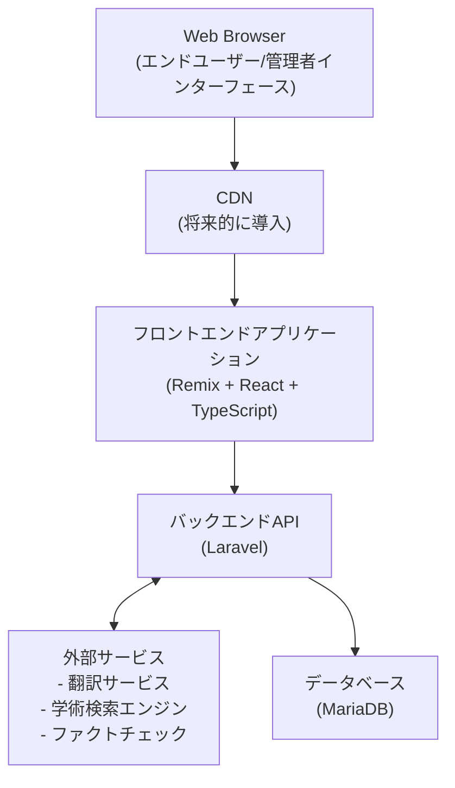
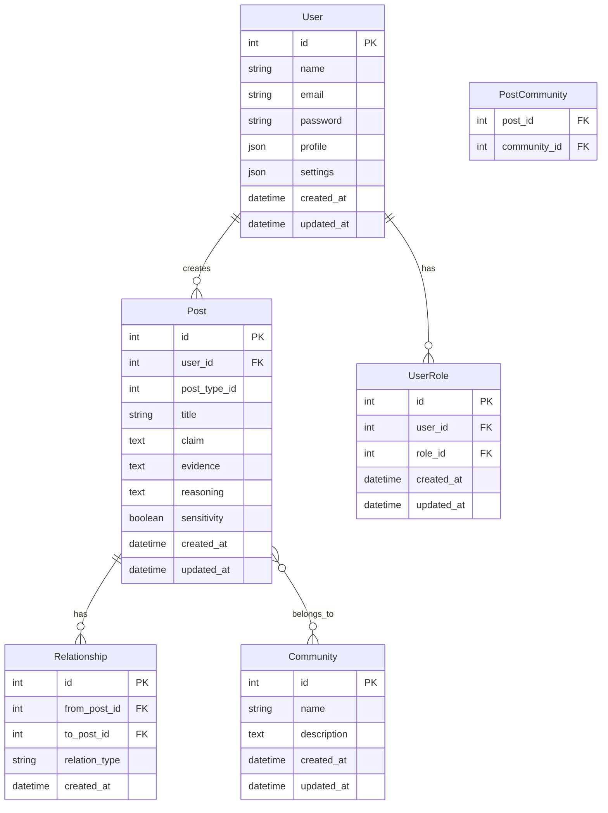
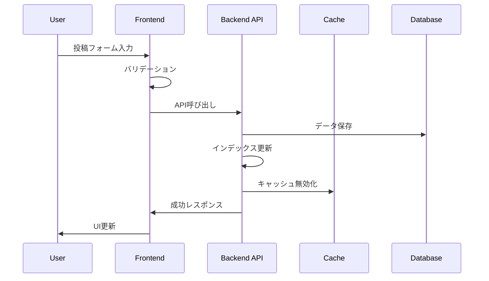
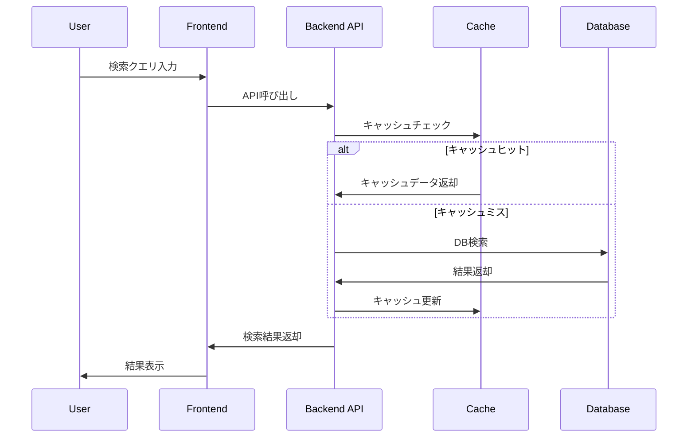
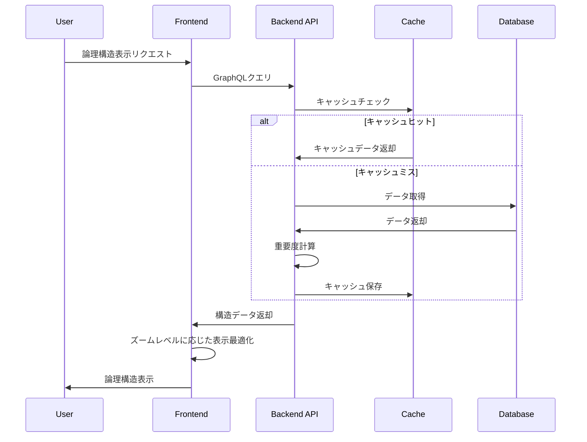

# アーキテクチャ仕様書

## システム概要

ディベートの論理構造ネストして理論構造を可視化する。
ノードの数が多くなればなるほどあらゆることで検証されているため情報が確かになる

## システムコンテキスト図

この図は、システムの主要コンポーネントとその相互関係を示しています。ユーザーはWebブラウザを通じてシステムにアクセスし、フロントエンドアプリケーションがバックエンドAPIと通信します。システムはまた、翻訳サービスや学術検索エンジンなどの外部サービスと連携し、機能を拡張します。

## 主機能

* 投稿システム
    * 「主張」「根拠」「論拠」のセット形式での投稿機能
    * 10種類の投稿形式（問題提示、問題分割、解決策提示、補足、要約、翻訳、推定、検証、倫理、論理的文章）
    * マルチメディア証拠（PDF、画像、音声、サイトURL、数式）のアップロード
    * センシティブフラグ設定
* 論理構造の可視化
    * ツリー状の議論構造表示
    * 多対多の関係性マッピング
    * 論理的繋がりの視覚化
* ユーザー認証・管理
    * アカウント作成と認証
    * 権限管理
    * ユーザープロファイル
* コンテンツモデレーション
    * 禁止事項（誹謗中傷等）の監視
    * センシティブコンテンツのフィルタリング
    * 証拠の集団検証システム
* 検索・ナビゲーション
    * 問題/解決策の検索
    * フィルタリング機能
    * トピック/カテゴリ分類
* インタラクション機能
    * 投稿への反応（評価等）
    * フォロー機能
    * シェア機能
    * 通知システム

## 機能要件 (システムが何をすべきか)

1. ユーザー管理

アカウント登録・ログイン機能
プロフィール設定・編集機能
ユーザー権限管理（一般ユーザー、モデレーター等）
アカウント認証（メール認証、2要素認証等）

2. 投稿システム

「主張」「根拠」「論拠」セットでの投稿作成
10種類の投稿形式選択（問題提示、問題分割、解決策提示、補足、要約、翻訳、推定、検証、倫理、論理的文章）
テキストエディタ（書式設定、数式入力機能）
下書き保存・編集機能
センシティブコンテンツ設定

3. マルチメディア管理

複数形式の証拠アップロード（PDF、画像、音声ファイル）
URLリンク添付機能（サイト魚拓）
数式エディタ・表示機能
メディアプレビュー機能

4. 議論構造化

ツリー表示機能
多対多関係の可視化
投稿間の関連付け機能
論理構造のグラフィカル表示

5. インタラクション

投稿へのリアクション機能
証拠の検証機能（複数ユーザーによる検証プロセス）
コメント・返信機能
投稿の保存・共有機能
シェア機能
質問形式の投稿促進
投稿のハードルを下げる機能

6. 検索・発見

高度な検索機能（キーワード、トピック、形式等）
フィルタリング・ソート機能
トレンド・人気投稿表示
関連投稿推薦機能

7. モデレーション

不適切コンテンツの報告機能
センシティブコンテンツのフラグ付け・フィルタリング
コンテンツ審査ワークフロー
違反ユーザーの管理機能

8. 通知・アラート

返信・リアクション通知
検証リクエスト通知
ニュースレター・ダイジェスト配信
イベント通知

9. 設定・カスタマイズ

センシティブコンテンツ表示設定
言語・ローカライゼーション設定
テーマ・レイアウト設定
通知設定

10. API・連携

外部サービス連携（検証ツール等）
データエクスポート機能
埋め込み共有機能
サードパーティ連携

11. 分析・レポート

議論の進行状況追跡
統計・インサイト表示
アクティビティログ
コミュニティ貢献度指標
倫理観の可視化・評価

12. セキュリティ・プライバシー

データ暗号化
プライバシー設定管理
セキュリティ監査ログ
GDPRなどの法令遵守機能

## 非機能要件

### パフォーマンス要件
* ページロード時間：2秒以内（95パーセンタイル）
* 大規模ツリー表示時のレンダリング最適化（1000ノード以上）
  * ズームレベルに応じたノード描画の最適化
  * ノード重要度計算の効率的なアルゴリズム実装
* レスポンス時間：API呼び出し200ms以内
* 同時接続ユーザー数：最大10,000ユーザー

### セキュリティ要件
* OWASP Top 10対策の実装
* データ暗号化（保存時と通信時）
* CSRF/XSS対策
* レート制限の実装
* ユーザーデータのアクセス制御

### アクセシビリティ
* WCAG 2.1 AA準拠
* 多言語対応（日英）
  * 投稿コンテンツは翻訳機能があるため、UIやシステムメッセージのみ多言語対応
* モバイルファーストデザイン
* 低速ネットワーク環境への最適化

## データアーキテクチャ

### 主要データモデル（ERD概略）

### キャッシュ戦略

1. **フロントエンドキャッシュ**
   - React Query を使用したクライアントサイドキャッシング
   - Service Worker によるオフラインサポート（将来的に導入）

2. **バックエンドキャッシュ**
   - Redis キャッシュ（将来的に導入）
   - 頻繁にアクセスされる投稿やツリー構造のキャッシュ
   - 検索結果キャッシュ（15分有効）

3. **データベースクエリキャッシュ**
   - 複雑なクエリ結果のキャッシング（Laravel クエリキャッシュ）
   - 重要度計算指標のインデックス化と事前計算

### データフロー

#### 検索クエリフロー

#### 論理構造表示フロー

## モニタリングと運用

### ログ収集・分析

1. **アプリケーションログ**
   - Laravel ログシステムを使用
   - 重要なユーザーアクション、エラー、警告を記録
   - 構造化ロギング形式（JSON）の採用

2. **アクセスログ**
   - Laravel ミドルウェアを使用したアクセスログ記録（共有サーバーでNginxログにアクセスできないため）
   - ユーザーエージェント、IP、リクエストメソッド、URL、レスポンスコードの記録
   - ボット、クローラーの識別
   - 異常アクセスパターンの検出

3. **パフォーマンスメトリクス**
   - API応答時間の記録
   - DB操作時間の記録
   - 重いクエリのトラッキング

### 監視システム

1. **稼働監視**
   - Laravel スケジューラを使用した定期的なヘルスチェック
   - アプリケーションレベルでのリソース監視（共有サーバーのため直接的なサーバーリソース監視は制限あり）
   - 例外発生時の自動通知

2. **パフォーマンス監視**
   - ページロード時間の測定
   - API応答時間の測定
   - データベース負荷の監視
   - キャッシュヒット率の監視

3. **ユーザー体験監視**
   - リアルユーザーモニタリング（RUM）
   - エラー率の監視
   - フロントエンドパフォーマンス指標の収集

### インシデント対応

1. **アラート設定**
   - 異常検知時のEメール/Slack通知
   - エスカレーションフロー
   - オンコール体制（将来的に）

2. **トラブルシューティングガイド**
   - 一般的な問題に対する対応手順書
   - ログ分析ガイドライン
   - 緊急時のロールバック手順

## コンプライアンスと法的要件

### データプライバシー

1. **個人情報保護対策**
   - 個人情報の最小限の収集
   - 利用目的の明確化と同意取得
   - アクセス制御とデータ暗号化

2. **GDPR対応**
   - データポータビリティ（エクスポート機能）
   - 忘れられる権利（アカウント削除機能）
   - データ処理の記録

3. **Cookie ポリシー**
   - 必要最小限のCookie使用
   - オプトイン/オプトアウトの仕組み
   - 明確な通知と同意取得

### アクセシビリティコンプライアンス

1. **WCAG 2.1 AA準拠**
   - スクリーンリーダー対応
   - キーボードナビゲーション
   - コントラスト比の確保
   - 代替テキストの提供

2. **多言語対応**
   - UIとシステムメッセージの日英対応
   - 右から左への言語サポート（将来的に）

## 技術要件(システムがどのように実装されるか)

### 実装フェーズ

#### フェーズ1（MVP）
* 基本的なユーザー認証・管理
* 主要な投稿機能（問題提示、解決策提示、補足）
* 基本的な論理構造表示（シンプルなツリービュー）
* 基本検索・フィルタリング
* 最小限のモデレーション機能
* シンプルなUI（レスポンシブ対応）
* 管理者サイト基本機能

#### フェーズ2（拡張）
* 全10種類の投稿形式サポート
* 高度な論理構造可視化（ネットワークビュー）
* 信頼性スコアシステム
* コミュニティ機能
* 通知システム
* 高度なフィルタリング・検索機能

#### フェーズ3（完全版）
* AIアシスタント機能
* 時系列ビュー
* 高度なパーソナライゼーション
* コラボレーション機能
* 外部システム連携
* 高度なアクセシビリティ対応

### フロントエンド
    * Remix (Reactフレームワーク)
    * React
    * Ant Design (ReactのUIコンポーネントライブラリ)
    * TypeScript
    * TailwindCSS
    * 多言語対応（UIやシステムメッセージのみ、投稿コンテンツは翻訳機能で対応）

### 管理者フロントエンド
    * 別SPAとして実装
    * React
    * Ant Design Pro (管理者向けUIコンポーネント)
    * TypeScript
    * 独立したデプロイとホスティング
    * 別ドメインまたはサブドメインでの提供
    * 専用の認証システム（多要素認証対応）

### バックエンド

フレームワーク Laravel 12.x

データベース MariaDB 10.5.x

### サーバー

xserver(レンタルサーバー)

使用可能なミドルウェア nginx PHP8 Cron

## 開発・運用ライフサイクル

### 開発環境

1. **ローカル開発環境**
   - Docker開発環境
   - 開発用データベース (SQLite/MariaDB)
   - Hot Reloading対応

2. **開発プロセス**
   - GitHubフローによるブランチ管理
   - プルリクエストと強制的なコードレビュー
   - 自動テスト実行（GitHub Actions）

### テスト戦略

1. **ユニットテスト**
   - PHPUnit（Laravel）
   - Jest（React/TypeScript）
   - ビジネスロジックの網羅的テスト

2. **統合テスト**
   - API統合テスト（エンドポイントごと）
   - フロントエンドコンポーネントテスト
   - データフローの検証

3. **E2Eテスト**
   - Cypress を使用したブラウザテスト
   - 主要ユーザーフロー（登録・投稿・検索）の検証
   - レスポンシブデザインの検証

4. **パフォーマンステスト**
   - API負荷テスト
   - 大規模データセットでの可視化テスト
   - ブラウザパフォーマンス計測

### デプロイメント

1. **ステージング環境**
   - 本番環境レプリカでのプレリリーステスト
   - 手動QA検証
   - ステークホルダーデモ

2. **本番環境デプロイプロセス**
   - Gitタグベースのリリースフロー
   - ブルー/グリーンデプロイメント（将来的に）
   - ゼロダウンタイムデプロイ（可能な限り）

3. **リリース後監視**
   - デプロイ直後の重点的モニタリング
   - カナリアテスト（一部ユーザーへの段階的ロールアウト）
   - 緊急ロールバック手順

#### 使用するAPIパターン

RESTful API:
    投稿の作成・更新・削除
    ユーザー管理
    マルチメディア管理
    管理者API（別途認証と権限管理）

GraphQL:
    投稿の取得
    複雑な論理構造と多対多の関係性の取得に最適
    クライアントが必要なデータだけを正確に取得できる（オーバーフェッチングの回避）
    ツリー状の議論構造や関連投稿を効率的に一度のリクエストで取得

Webhook(保留):
    アプリを作成する際に追加予定
    リアルタイム通知（新しい返信、検証結果など）に利用

WebSocketの導入(保留):
    リアルタイムの議論状況や協調編集機能のサポート
    複数ユーザーによるリアルタイム検証作業に有効

