# アーキテクチャ仕様書

## システム概要

ディベートの論理構造ネストして理論構造を可視化する。
ノードの数が多くなればなるほどあらゆることで検証されているため情報が確かになる

## システムコンテキスト図

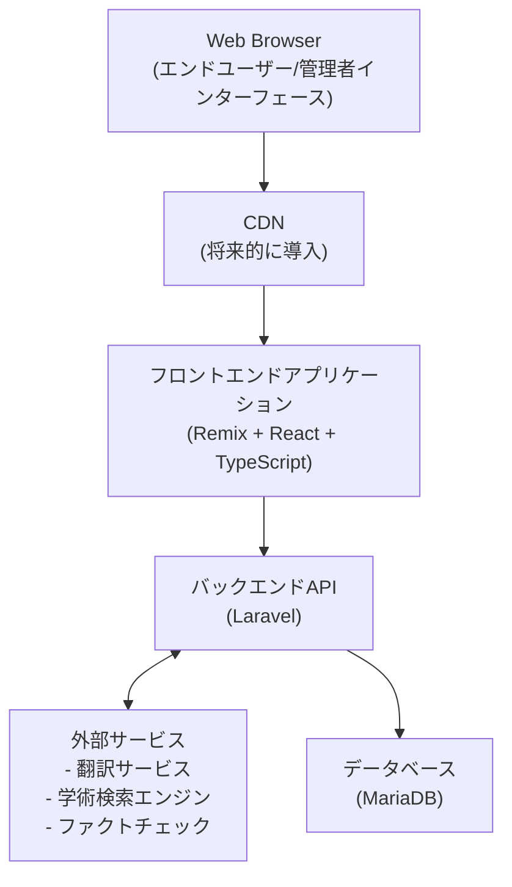
```mermaid
flowchart TD
    Browser["Web Browser\n(エンドユーザー/管理者インターフェース)"]
    CDN["CDN\n(将来的に導入)"]
    Frontend["フロントエンドアプリケーション\n(Remix + React + TypeScript)"]
    Backend["バックエンドAPI\n(Laravel)"]
    DB["データベース\n(MariaDB)"]
    External["外部サービス\n- 翻訳サービス\n- 学術検索エンジン\n- ファクトチェック"]
    
    Browser --> CDN
    CDN --> Frontend
    Frontend --> Backend
    Backend <--> External
    Backend --> DB
```

この図は、システムの主要コンポーネントとその相互関係を示しています。ユーザーはWebブラウザを通じてシステムにアクセスし、フロントエンドアプリケーションがバックエンドAPIと通信します。システムはまた、翻訳サービスや学術検索エンジンなどの外部サービスと連携し、機能を拡張します。

## 主機能

* 投稿システム
    * 「主張」「根拠」「論拠」のセット形式での投稿機能
    * 10種類の投稿形式（問題提示、問題分割、解決策提示、補足、要約、翻訳、推定、検証、倫理、論理的文章）
    * マルチメディア証拠（PDF、画像、音声、サイトURL、数式）のアップロード
    * センシティブフラグ設定
* 論理構造の可視化
    * ツリー状の議論構造表示
    * 多対多の関係性マッピング
    * 論理的繋がりの視覚化
* ユーザー認証・管理
    * アカウント作成と認証
    * 権限管理
    * ユーザープロファイル
* コンテンツモデレーション
    * 禁止事項（誹謗中傷等）の監視
    * センシティブコンテンツのフィルタリング
    * 証拠の集団検証システム
    * 著作権侵害検出システム
    * ライセンス互換性検証
    * 第三者コンテンツ引用ルール適用
* 検索・ナビゲーション
    * 問題/解決策の検索
    * フィルタリング機能
    * トピック/カテゴリ分類
* インタラクション機能
    * 投稿への反応（評価等）
    * フォロー機能
    * シェア機能
    * 通知システム

## 機能要件 (システムが何をすべきか)

1. ユーザー管理

アカウント登録・ログイン機能
プロフィール設定・編集機能
ユーザー権限管理（一般ユーザー、モデレーター等）
アカウント認証（メール認証、2要素認証等）

2. 投稿システム

「主張」「根拠」「論拠」セットでの投稿作成
10種類の投稿形式選択（問題提示、問題分割、解決策提示、補足、要約、翻訳、推定、検証、倫理、論理的文章）
テキストエディタ（書式設定、数式入力機能）
下書き保存・編集機能
センシティブコンテンツ設定

3. マルチメディア管理

複数形式の証拠アップロード（PDF、画像、音声ファイル）
URLリンク添付機能（サイト魚拓）
数式エディタ・表示機能
メディアプレビュー機能

4. 議論構造化

ツリー表示機能
多対多関係の可視化
投稿間の関連付け機能
論理構造のグラフィカル表示

5. インタラクション

投稿へのリアクション機能
証拠の検証機能（複数ユーザーによる検証プロセス）
コメント・返信機能
投稿の保存・共有機能
シェア機能
質問形式の投稿促進
投稿のハードルを下げる機能

6. 検索・発見

高度な検索機能（キーワード、トピック、形式等）
フィルタリング・ソート機能
トレンド・人気投稿表示
関連投稿推薦機能

7. モデレーション

不適切コンテンツの報告機能
センシティブコンテンツのフラグ付け・フィルタリング
コンテンツ審査ワークフロー
違反ユーザーの管理機能

8. 通知・アラート

返信・リアクション通知
検証リクエスト通知
ニュースレター・ダイジェスト配信
イベント通知

9. 設定・カスタマイズ

センシティブコンテンツ表示設定
言語・ローカライゼーション設定
テーマ・レイアウト設定
通知設定

10. API・連携

外部サービス連携（検証ツール等）
データエクスポート機能
埋め込み共有機能
サードパーティ連携

11. 分析・レポート

議論の進行状況追跡
統計・インサイト表示
アクティビティログ
コミュニティ貢献度指標
倫理観の可視化・評価

12. セキュリティ・プライバシー

データ暗号化
プライバシー設定管理
セキュリティ監査ログ
GDPRなどの法令遵守機能

## 非機能要件

### パフォーマンス要件
* ページロード時間：2秒以内（95パーセンタイル）
* 大規模ツリー表示時のレンダリング最適化（1000ノード以上）
  * ズームレベルに応じたノード描画の最適化
  * ノード重要度計算の効率的なアルゴリズム実装
* レスポンス時間：API呼び出し200ms以内
* 同時接続ユーザー数：最大10,000ユーザー

### セキュリティ要件
* OWASP Top 10対策の実装
* データ暗号化（保存時と通信時）
* CSRF/XSS対策
* レート制限の実装
* ユーザーデータのアクセス制御

### アクセシビリティ
* WCAG 2.1 AA準拠
* 多言語対応（日英）
  * 投稿コンテンツは翻訳機能があるため、UIやシステムメッセージのみ多言語対応
* モバイルファーストデザイン
* 低速ネットワーク環境への最適化

## データアーキテクチャ

### 主要データモデル（ERD概略）

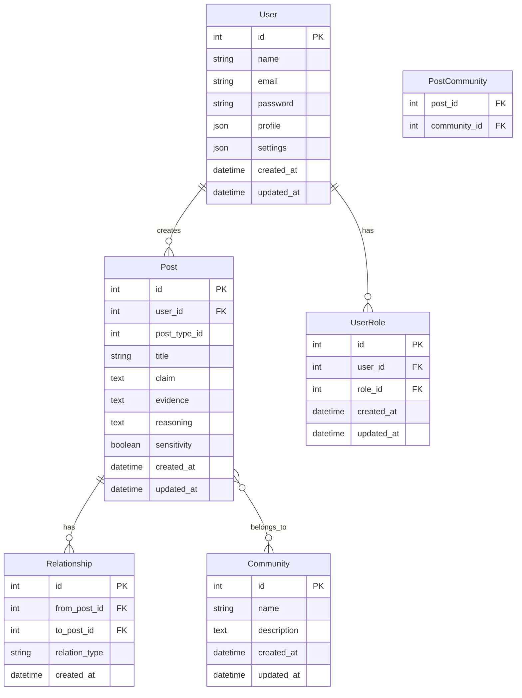
```mermaid
erDiagram
    User ||--o{ Post : creates
    User ||--o{ UserRole : has
    Post ||--o{ Relationship : has
    Post }o--o{ Community : belongs_to
    
    User {
        int id PK
        string name
        string email
        string password
        json profile
        json settings
        datetime created_at
        datetime updated_at
    }
    
    Post {
        int id PK
        int user_id FK
        int post_type_id
        string title
        text claim
        text evidence
        text reasoning
        boolean sensitivity
        datetime created_at
        datetime updated_at
    }
    
    Community {
        int id PK
        string name
        text description
        datetime created_at
        datetime updated_at
    }
    
    UserRole {
        int id PK
        int user_id FK
        int role_id FK
        datetime created_at
        datetime updated_at
    }
    
    Relationship {
        int id PK
        int from_post_id FK
        int to_post_id FK
        string relation_type
        datetime created_at
    }
    
    PostCommunity {
        int post_id FK
        int community_id FK
    }
```

### キャッシュ戦略

1. **フロントエンドキャッシュ**
   - React Query を使用したクライアントサイドキャッシング
   - Service Worker によるオフラインサポート（将来的に導入）

2. **バックエンドキャッシュ**
   - Redis キャッシュ（将来的に導入）
   - 頻繁にアクセスされる投稿やツリー構造のキャッシュ
   - 検索結果キャッシュ（15分有効）

3. **データベースクエリキャッシュ**
   - 複雑なクエリ結果のキャッシング（Laravel クエリキャッシュ）
   - 重要度計算指標のインデックス化と事前計算

### データフロー

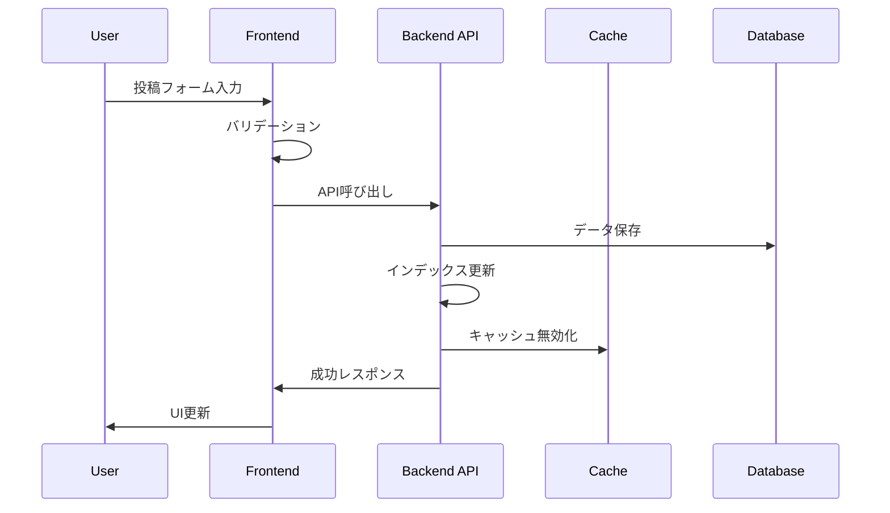
```mermaid
sequenceDiagram
    participant U as User
    participant F as Frontend
    participant B as Backend API
    participant C as Cache
    participant DB as Database
    
    %% 投稿作成フロー
    U->>F: 投稿フォーム入力
    F->>F: バリデーション
    F->>B: API呼び出し
    B->>DB: データ保存
    B->>B: インデックス更新
    B->>C: キャッシュ無効化
    B->>F: 成功レスポンス
    F->>U: UI更新
```

#### 検索クエリフロー

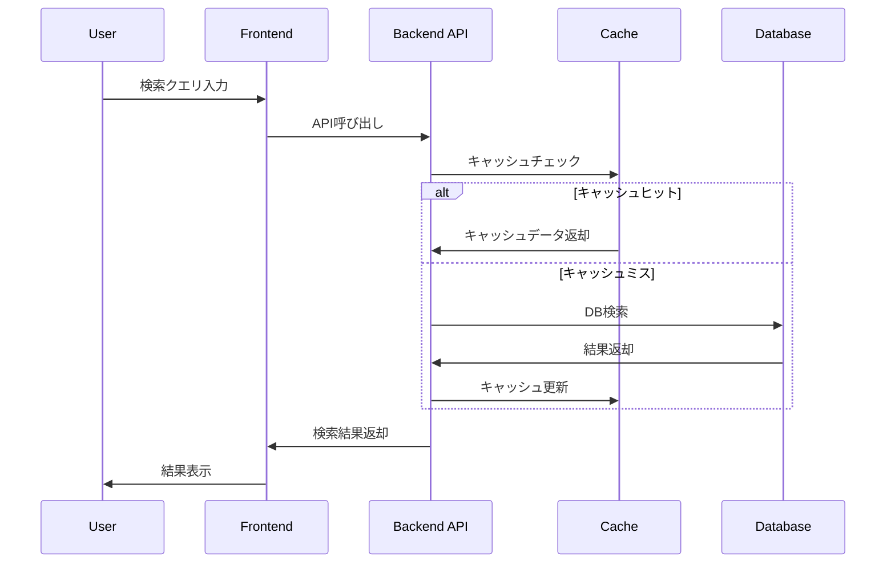
```mermaid
sequenceDiagram
    participant U as User
    participant F as Frontend
    participant B as Backend API
    participant C as Cache
    participant DB as Database
    
    U->>F: 検索クエリ入力
    F->>B: API呼び出し
    B->>C: キャッシュチェック
    
    alt キャッシュヒット
        C->>B: キャッシュデータ返却
    else キャッシュミス
        B->>DB: DB検索
        DB->>B: 結果返却
        B->>C: キャッシュ更新
    end
    
    B->>F: 検索結果返却
    F->>U: 結果表示
```

#### 論理構造表示フロー

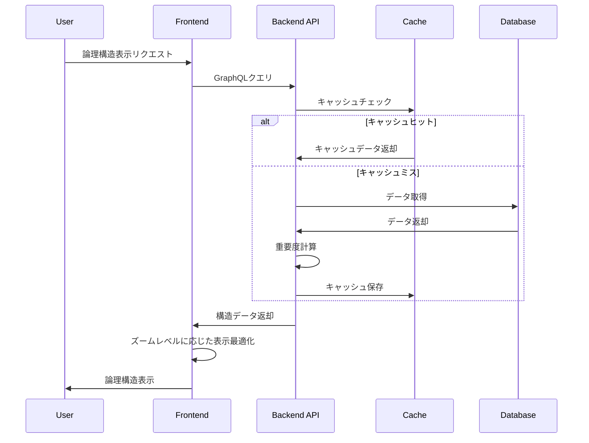
```mermaid
sequenceDiagram
    participant U as User
    participant F as Frontend
    participant B as Backend API
    participant C as Cache
    participant DB as Database
    
    U->>F: 論理構造表示リクエスト
    F->>B: GraphQLクエリ
    B->>C: キャッシュチェック
    
    alt キャッシュヒット
        C->>B: キャッシュデータ返却
    else キャッシュミス
        B->>DB: データ取得
        DB->>B: データ返却
        B->>B: 重要度計算
        B->>C: キャッシュ保存
    end
    
    B->>F: 構造データ返却
    F->>F: ズームレベルに応じた表示最適化
    F->>U: 論理構造表示
```

## モニタリングと運用

### ログ収集・分析

1. **アプリケーションログ**
   - Laravel ログシステムを使用
   - 重要なユーザーアクション、エラー、警告を記録
   - 構造化ロギング形式（JSON）の採用

2. **アクセスログ**
   - Laravel ミドルウェアを使用したアクセスログ記録（共有サーバーでNginxログにアクセスできないため）
   - ユーザーエージェント、IP、リクエストメソッド、URL、レスポンスコードの記録
   - ボット、クローラーの識別
   - 異常アクセスパターンの検出

3. **パフォーマンスメトリクス**
   - API応答時間の記録
   - DB操作時間の記録
   - 重いクエリのトラッキング

### 監視システム

1. **稼働監視**
   - Laravel スケジューラを使用した定期的なヘルスチェック
   - アプリケーションレベルでのリソース監視（共有サーバーのため直接的なサーバーリソース監視は制限あり）
   - 例外発生時の自動通知

2. **パフォーマンス監視**
   - ページロード時間の測定
   - API応答時間の測定
   - データベース負荷の監視
   - キャッシュヒット率の監視

3. **ユーザー体験監視**
   - リアルユーザーモニタリング（RUM）
   - エラー率の監視
   - フロントエンドパフォーマンス指標の収集

### インシデント対応

1. **アラート設定**
   - 異常検知時のEメール/Slack通知
   - エスカレーションフロー
   - オンコール体制（将来的に）

2. **トラブルシューティングガイド**
   - 一般的な問題に対する対応手順書
   - ログ分析ガイドライン
   - 緊急時のロールバック手順

## コンプライアンスと法的要件

### データプライバシー

1. **個人情報保護対策**
   - 個人情報の最小限の収集
   - 利用目的の明確化と同意取得
   - アクセス制御とデータ暗号化

2. **GDPR対応**
   - データポータビリティ（エクスポート機能）
   - 忘れられる権利（アカウント削除機能）
   - データ処理の記録

3. **Cookie ポリシー**
   - 必要最小限のCookie使用
   - オプトイン/オプトアウトの仕組み
   - 明確な通知と同意取得

### アクセシビリティコンプライアンス

1. **WCAG 2.1 AA準拠**
   - スクリーンリーダー対応
   - キーボードナビゲーション
   - コントラスト比の確保
   - 代替テキストの提供

2. **多言語対応**
   - UIとシステムメッセージの日英対応
   - 右から左への言語サポート（将来的に）

## 技術要件(システムがどのように実装されるか)

### 実装フェーズ

#### フェーズ1（MVP）
* 基本的なユーザー認証・管理
* 主要な投稿機能（問題提示、解決策提示、補足）
* 基本的な論理構造表示（シンプルなツリービュー）
* 基本検索・フィルタリング
* 最小限のモデレーション機能
* シンプルなUI（レスポンシブ対応）
* 管理者サイト基本機能

#### フェーズ2（拡張）
* 全10種類の投稿形式サポート
* 高度な論理構造可視化（ネットワークビュー）
* 信頼性スコアシステム
* コミュニティ機能
* 通知システム
* 高度なフィルタリング・検索機能

#### フェーズ3（完全版）
* AIアシスタント機能
* 時系列ビュー
* 高度なパーソナライゼーション
* コラボレーション機能
* 外部システム連携
* 高度なアクセシビリティ対応

### ビジュアライゼーション最適化

#### グラフ可視化高速化アーキテクチャ

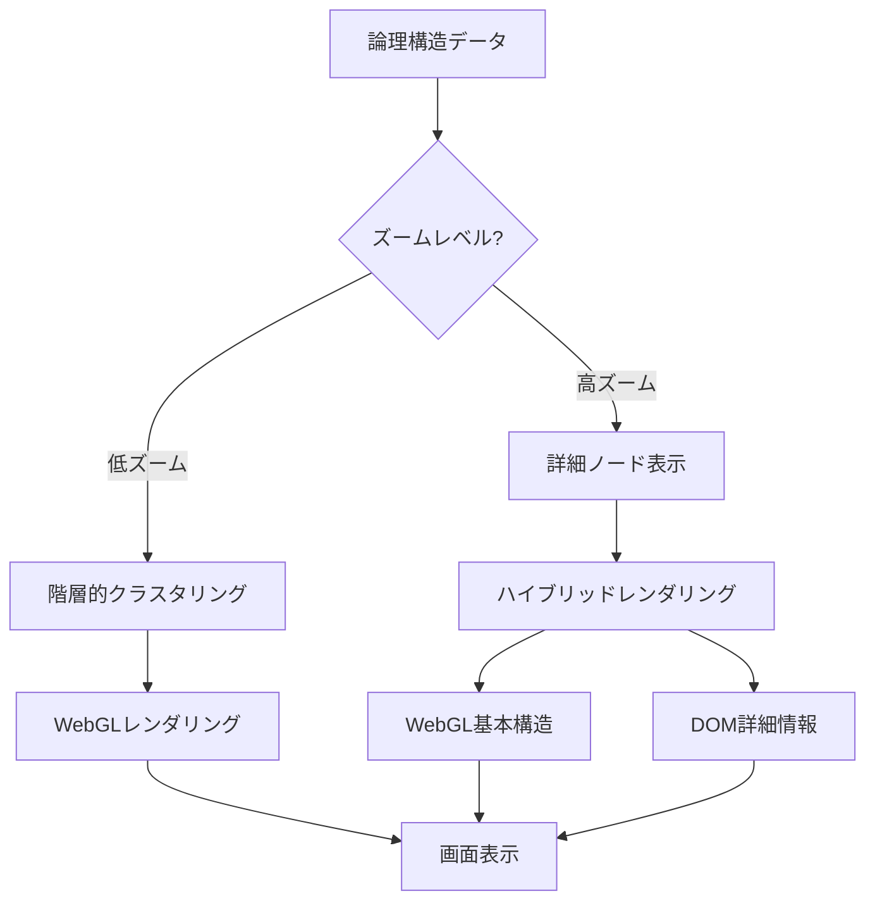
```mermaid
flowchart TD
    A[論理構造データ] --> B{ズームレベル?}
    B -->|低ズーム| C[階層的クラスタリング]
    B -->|高ズーム| D[詳細ノード表示]
    C --> E[WebGLレンダリング]
    D --> F[ハイブリッドレンダリング]
    F --> G[WebGL基本構造]
    F --> H[DOM詳細情報]
    E --> I[画面表示]
    G --> I
    H --> I
```

ハイブリッドレンダリングエンジン

WebGLコアエンジン: Three.jsを使用した高速グラフィックス処理
DOM仮想化レイヤー: react-windowによる効率的なUIコンポーネント管理
レイヤー間連携: イベントとデータの双方向バインディング


階層的クラスタリング処理

サーバーサイド前処理: 5段階の階層構造を事前計算
クラスタリングアルゴリズム: Louvainアルゴリズムで重要度を考慮した集約
ズームレベル適応: viewportとズーム率に基づく適切な階層選択


レンダリングパフォーマンス最適化

WebGLインスタンシング: GPUインスタンス描画による大量ノード表示
視覚的詳細度(LOD): 距離に応じた描画詳細度の自動調整
オクルージョンカリング: 視野外・重なりノードの描画省略


インタラクション最適化

空間インデックス: Quadtreeによる空間クエリ高速化
インタラクティブ描画調整: 操作中は解像度下げ、静止時に高精細化
Web Worker分離: レイアウト計算をバックグラウンドスレッドで実行


データストリーミング

段階的詳細化: 表示領域の重要ノードから順次詳細データをロード
バウンディングボリューム階層: 空間的なデータローディング最適化
エッジバンドリング: 関連性エッジの視覚的簡略化と転送量削減

## 重要アルゴリズム詳細

### ノード重要度計算アルゴリズム

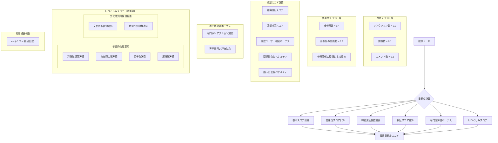
```mermaid
flowchart TD
    A[投稿ノード] --> B{重要度計算}
    B --> C[基本スコア計算]
    B --> D[関連性スコア計算]
    B --> E[時間減衰係数計算]
    B --> V[検証スコア計算]
    B --> X[専門性評価ボーナス]
    B --> Y[いつくしみスコア]
    C --> F[最終重要度スコア]
    D --> F
    E --> F
    V --> F
    X --> F
    Y --> F
    
    subgraph basic["基本スコア計算"]
        C1["リアクション数 × 0.3"]
        C2["閲覧数 × 0.1"]
        C3["コメント数 × 0.2"]
    end
    
    subgraph relation["関連性スコア計算"]
        D1["被参照数 × 0.4"]
        D2["参照先の重要度 × 0.2"]
        D3["参照関係の種類による重み"]
    end
    
    subgraph verification["検証スコア計算"]
        V1["証拠検証スコア"]
        V2["論拠検証スコア"]
        V3["複数ユーザー検証ボーナス"]
        V4["関連性欠如ペナルティ"]
        V5["誤った主張ペナルティ"]
    end
    
    subgraph expertise["専門性評価ボーナス"]
        X1["専門家リアクション加重"]
        X2["専門家否定評価減点"]
    end
    
    subgraph ethics["いつくしみスコア（最重要）"]
        subgraph universal["普遍的倫理要素"]
            Y1["対話促進度評価"]
            Y2["危害防止性評価"]
            Y3["公平性評価"]
            Y4["透明性評価"]
        end
        subgraph cultural["文化特異的倫理要素"]
            Y5["文化固有価値評価"]
            Y6["地域別価値観適応"]
        end
    end
    
    subgraph time["時間減衰係数"]
        E1["exp(-0.05 × 経過日数)"]
    end
```

ノード重要度の計算式：

```
重要度 = (基本スコア + 関連性スコア + 検証スコア + 専門性評価ボーナス + いつくしみスコア × 2.0) × 時間減衰係数

基本スコア = (リアクション数 × 0.3) + (閲覧数 × 0.1) + (コメント数 × 0.2)

関連性スコア = (被参照数 × 0.4) + (参照先の重要度合計 × 0.2) + 関係種類ボーナス
  * 関係種類ボーナス: 補足=0.1, 検証=0.3, 反論=0.2, 要約=0.15

検証スコア = (証拠検証数 × 0.5) + (論拠検証数 × 0.5) + 複数ユーザー検証ボーナス - 関連性欠如ペナルティ - 誤った主張ペナルティ
  * 証拠検証数 = 証拠に対する検証投稿の数
  * 論拠検証数 = 論拠に対する検証投稿の数
  * 複数ユーザー検証ボーナス = min(検証したユニークユーザー数 × 0.25, 1.0)
    (異なるユーザーが多く検証するほど上限1.0までボーナス増加)
  * 関連性欠如ペナルティ = 関連性欠如フラグの有無 × 2.0
    (証拠が事実であっても主張や論拠との関連性が不十分と判断された場合に適用)
    (関連性欠如フラグが立つと検証スコアに大きなペナルティを課し、重要度を著しく下げる)
  * 誤った主張ペナルティ = 誤った主張フラグの有無 × 3.0
    (証拠や論拠が正確でも、それらから導かれる主張が論理的に誤っている場合に適用)
    (証拠と論拠から導かれない結論、論理的飛躍、因果関係の誤認などが該当)
    (誤った主張フラグが立つと検証スコアに最大級のペナルティを課し、重要度を最小化)

専門性評価ボーナス = 専門家肯定評価スコア - 専門家否定評価スコア
  * 専門家肯定評価スコア = Σ(肯定的リアクションを行った各ユーザーの専門性レベル × 0.2)
  * 専門家否定評価スコア = Σ(否定的リアクションを行った各ユーザーの専門性レベル × 0.3)
  * 専門性レベル = 分野別に自動計算されるユーザーの信頼性スコア（1〜5）
    - レベル1: 一般ユーザー（重み×1）- システム登録時の初期レベル
    - レベル2: 分野貢献者（重み×2）- 特定分野での貢献開始が認められたレベル
    - レベル3: 分野専門家（重み×3）- 多数の有益な貢献実績があるレベル
    - レベル4: 信頼専門家（重み×4）- 高い検証精度と信頼性が確立されたレベル
    - レベル5: 分野権威者（重み×5）- 卓越した貢献と影響力を持つレベル

### ユーザー専門性レベル算出システム

各分野（数学、物理学、医学、経済学など）ごとに独立して専門性レベルが計算されます。

```
分野別専門性スコア = (貢献投稿スコア × 0.3) + (検証精度スコア × 0.4) + (ピア評価スコア × 0.3)
```

1. **貢献投稿スコア**: 分野内での投稿数と質に基づく評価
   * 投稿数: 特定分野に関連した投稿回数
   * 投稿品質: 各投稿の重要度スコア平均値
   * 閾値: 50点で最大値到達、レベル向上に必要なベース点数

2. **検証精度スコア**: 検証活動の正確性に基づく評価
   * 検証正確率: (正確な検証数) ÷ (総検証数)
   * 検証量: 特定分野での総検証活動数
   * 検証合意度: 他のユーザーによる再検証での合意率
   * 閾値: 検証数30件以上かつ正確率85%以上で最大値

3. **ピア評価スコア**: 他の専門家からの評価に基づく評価
   * 高レベルユーザーからの承認: レベル4以上のユーザーからの肯定的評価
   * 専門家間合意: 同分野の他専門家との評価一致率
   * ピア引用: 他ユーザーの投稿から参照された回数
   * 閾値: 高レベルユーザー10人以上の肯定評価で最大値

専門性レベルの決定:
* レベル1 (0-20点): 初期ユーザー
* レベル2 (21-40点): 一定の貢献と正確性を示したユーザー
* レベル3 (41-60点): 優れた貢献と高い正確性を示したユーザー
* レベル4 (61-80点): 持続的な優れた貢献と高い信頼性を確立したユーザー
* レベル5 (81-100点): 最高レベルの貢献と信頼性を達成したユーザー

注: 
* レベル4および5への昇格には、自動評価に加えて分野専門家パネルによるレビューが必要
* 専門性レベルは固定ではなく、以下の条件でレベルダウンが発生する場合がある

### 専門性レベルダウンメカニズム

専門性の維持と最新性確保のため、以下の条件でレベルダウンが発生します。

1. **時間経過による緩やかな減衰**
   * 非アクティブ期間に応じた非常に緩やかな減衰: 研究活動に配慮し、長期間の非アクティブでも専門知識の価値を尊重
     - 1年の非アクティブ: 警告のみ（減点なし）
     - 2年の非アクティブ: 5ポイント減少
     - 3年の非アクティブ: 10ポイント減少
     - 5年の非アクティブ: 20ポイント減少
   * 最低保証スコア: レベル3以上のユーザーは、どれだけ長期間非アクティブでもレベル3未満には下がらない
   * 学術的活動認識: 外部学術発表やプロフィール更新によって「アクティブ」と見なされる期間を延長可能
   * リアクティベーション: 活動再開時に非常に速やかにスコア回復が可能（1ヶ月以内に元のレベルに回復）

2. **証拠の無効化への柔軟な対応**
   * 科学の進展を考慮した評価: 科学の自己修正性を尊重し、知見の更新による証拠無効化は通常の科学プロセスと認識
     - 外部要因による無効化（科学的知見の更新など）: ペナルティなし（学術的議論の一環として扱う）
     - 単純な検証ミス（確率的エラー）: 非常に軽微な減少（2ポイント）と注意喚起のみ
     - 重大な方法論的誤りによる無効化: 軽微な減少（5ポイント）と改善サポート提供
     - 意図的な誤情報と明確に判明: 中程度の減少（10〜15ポイント）と一時的な検証精査
   * 緩やかな累積評価: 多数の証拠提供・検証にはエラーの可能性も内在することを認識し、比率に基づく評価
     - 無効化率が10%未満: ペナルティなし（通常の科学的プロセスの範囲内）
     - 無効化率が10〜20%: 軽微な注意と選択的レビュー
     - 無効化率が20%以上: 段階的な介入と支援提供
   * 包括的異議申し立て: 無効化に対する多面的な異議申し立てプロセスと学術的討論の場の提供

3. **検証精度の支援的評価**
   * 柔軟な精度閾値: 学問領域の特性と検証の難易度を考慮した段階的評価
     - 直近50件の検証で精度が60%を下回った場合のみ、警告（減点なし）
     - 精度が50%を下回る場合、メンタリングとサポートを提供（軽微な減点5ポイント）
   * 長期的トレンド評価: 単発的な問題ではなく、持続的な課題にのみ対応
     - 連続6ヶ月間の精度低下が観測された場合にのみ、サポート付きレビュー
     - 複数の関連分野専門家との協働検証機会の提供
   * 専門分野尊重: 専門外の分野での検証は、積極的な学際的貢献として捉える
     - 専門外分野での誤りには減点なし（学習過程として扱う）
     - 専門分野の明確化と適切なタグ付けを促進
     - 学際的アプローチを評価し、複数分野での貢献に追加ボーナスを検討

4. **コミュニティフィードバックの慎重な運用**
   * 高い信頼性基準: 専門知識への敬意を維持するための厳格な基準設定
     - 信頼性フラグ: 同一分野の高レベルユーザー（レベル4以上）3人以上による具体的な証拠を伴う申し立てのみを考慮
     - 学術的議論と異なる見解は、信頼性への疑義とは区別して扱う
   * 慎重な多数決: 専門性に対する過剰な干渉を防ぐ保護メカニズム
     - 同レベル以上の同一分野専門家10人以上による評価減少提案があった場合のみレビュー検討
     - レビュープロセスは対象ユーザーの参加を含む透明性の高い形で実施
   * 倫理的配慮: 倫理違反の評価は学術的専門性とは明確に区別
     - 学術的誠実性に関わる明確な倫理違反（データ捏造など）のみを対象
     - いつくしみスコアに関わる一般的な倫理事項は専門性評価とは切り離して処理
     - 文化的・社会的背景の多様性を考慮した倫理的判断

すべてのレベルダウンプロセスは透明性を確保し、ユーザーに通知され、改善のためのガイダンスが提供されます。また、レベル4および5からのレベルダウンには、専門家パネルによる審査プロセスが含まれます。

いつくしみスコア = (普遍的倫理要素 × 0.7) + (文化特異的倫理要素 × 0.3)

普遍的倫理要素 = (対話促進度 + 危害防止性 + 公平性 + 透明性) / 4
  * 対話促進度: 建設的な対話を促す度合い（0〜1）
    - 他者の視点を尊重し、対話を奨励する内容ほど高スコア
    - 敵対的・分断的な表現を避けた提案ほど高スコア
  * 危害防止性: 害を与えず安全性を確保する度合い（0〜1）
    - 身体的・精神的被害を防止・軽減する内容ほど高スコア
    - 脆弱な立場の人々を保護する提案ほど高スコア
  * 公平性: 基本的な公正さの度合い（0〜1）
    - 明らかな差別や偏見がない説明ほど高スコア
    - 機会の平等を考慮した提案ほど高スコア
  * 透明性: 情報開示と誠実さの度合い（0〜1）
    - 情報源や前提条件を明示した内容ほど高スコア
    - 利益相反や限界を正直に開示した提案ほど高スコア

文化特異的倫理要素 = ユーザー設定や地域に基づき以下から適切に組み合わせ
  * 集団調和: 集団の和を重んじる文化での評価（日本など）
    - 集団の調和を維持・促進する内容ほど高スコア
    - 合意形成を促す提案ほど高スコア
  * 個人自律: 個人の自由を重んじる文化での評価（欧米など）
    - 個人の選択権を尊重する内容ほど高スコア
    - 自己決定を支援する提案ほど高スコア
  * 家族価値: 家族を重視する文化での評価
    - 家族の絆を強化する内容ほど高スコア
    - 世代間の尊重を促す提案ほど高スコア
  * 宗教的調和: 宗教的多様性のある地域での評価
    - 宗教間の相互理解を促進する内容ほど高スコア
    - 信仰の自由を尊重する提案ほど高スコア

注：
  1. いつくしみスコアは倫理委員会と多様な文化背景を持つ評価者によるレビューを組み合わせて算出
  2. ユーザーは自分の文化的背景や価値観に基づき、文化特異的要素の重みをカスタマイズ可能
  3. 地域ごとにローカライズされた評価基準を開発・適用（日本版、米国版、欧州版など）

時間減衰係数 = exp(-0.05 × 経過日数)
```

### 将来追加予定の重要度計算要素

システムの進化と共に、以下の要素を重要度計算に段階的に追加することを検討します：

1. **オリジナリティスコア**
   * 新規性: 既存投稿との類似性分析に基づく独自視点の評価
   * アイデア革新性: 従来にない発想や解決策の評価
   * 計算方法: 自然言語処理による意味的重複検出と独自性の数値化

2. **根拠品質スコア**
   * 引用品質: 学術論文、一次資料など高信頼情報源の評価
   * 引用多様性: 複数の独立した情報源からの裏付け度合い
   * 引用検証度: 引用内容の正確性と適切性の評価

3. **コミュニティ関連性**
   * コミュニティスコア: 特定コミュニティ内での関心度・重要性
   * パーソナライズド重要度: ユーザーの関心領域に基づく調整
   * トピック関連度: 特定のトピックにおける中心性の評価

4. **議論促進度**
   * 議論分岐度: 投稿から発展した有意義な議論の広がり
   * 意見多様性促進: 多様な視点を引き出した程度
   * 解決貢献度: 問題解決や意見集約への貢献度

5. **情報網羅性**
   * 包括性: 論点・側面の網羅度
   * 多角的視点: 異なる立場からの検討度合い
   * 情報粒度: 適切な詳細レベルの提供度

これらの要素は、システムの発展段階や利用状況に応じて優先順位を決定し、ユーザーフィードバックを基に段階的に実装します。各要素の正確な計算方法と重み付けは、初期データ分析と実際の使用パターンに基づいて調整します。

### ズームレベル対応表示アルゴリズム

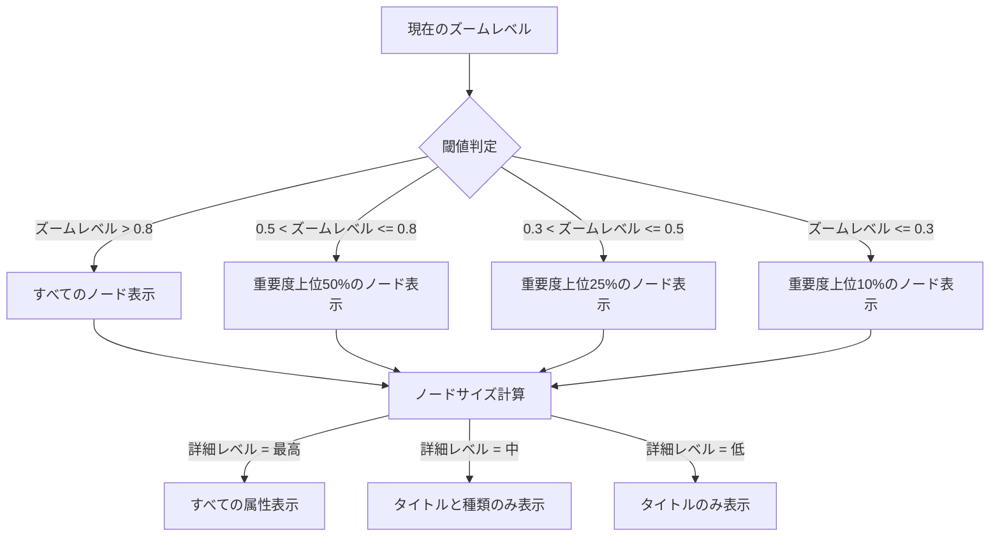
```mermaid
flowchart TD
    A["現在のズームレベル"] --> B{"閾値判定"}
    B -->|"ズームレベル > 0.8"| C["すべてのノード表示"]
    B -->|"0.5 < ズームレベル <= 0.8"| D["重要度上位50%のノード表示"]
    B -->|"0.3 < ズームレベル <= 0.5"| E["重要度上位25%のノード表示"]
    B -->|"ズームレベル <= 0.3"| F["重要度上位10%のノード表示"]
    
    C --> G["ノードサイズ計算"]
    D --> G
    E --> G
    F --> G
    
    G -->|"詳細レベル = 最高"| H1["すべての属性表示"]
    G -->|"詳細レベル = 中"| H2["タイトルと種類のみ表示"]
    G -->|"詳細レベル = 低"| H3["タイトルのみ表示"]
```

実装アルゴリズム詳細：

1. 現在表示されているツリーのすべてのノードの重要度をソート
2. ズームレベルに基づいて表示するノードの割合を決定
3. ノードの表示サイズは重要度に比例（最低サイズと最大サイズの範囲内）
4. 詳細レベルはズームレベルと相関：
   - 高ズームレベル：タイトル、投稿種類、作成者、日付、リアクション数を表示
   - 中ズームレベル：タイトルと投稿種類のみ表示
   - 低ズームレベル：タイトルのみ表示（一定文字数で切り捨て）

### 検索アルゴリズム

1. **複合検索スコアリング**
   - タイトル一致：×3.0の重み
   - 主張内容一致：×2.0の重み
   - 根拠・論拠一致：×1.5の重み
   - タグ一致：×1.2の重み
   - コメント内容一致：×0.8の重み

2. **関連性フィードバック**
   - ユーザーの検索履歴から学習
   - クリックされた検索結果の特性を強化
   - 共起語の関連度学習（将来的な機能）

3. **検索最適化**
   - インデックス最適化：タイトル、主張、タグのインデックス作成
   - 部分一致、あいまい検索のサポート
   - 日本語形態素解析による検索精度向上

## セキュリティアーキテクチャ

### 認証フロー

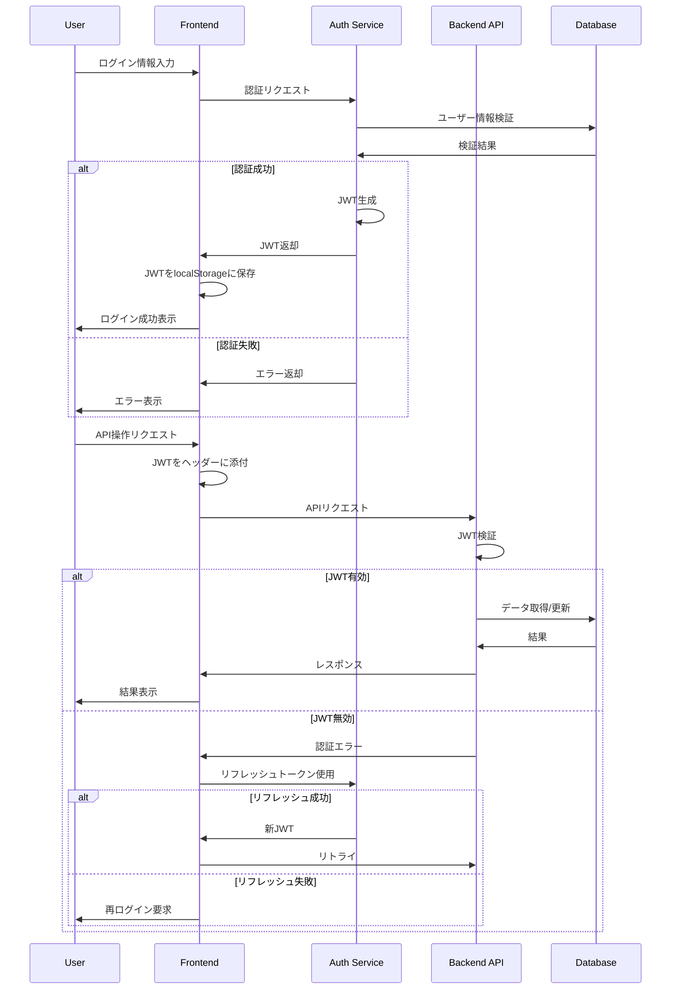
```mermaid
sequenceDiagram
    participant U as User
    participant F as Frontend
    participant A as Auth Service
    participant B as Backend API
    participant DB as Database
    
    %% ログインフロー
    U->>F: ログイン情報入力
    F->>A: 認証リクエスト
    A->>DB: ユーザー情報検証
    DB->>A: 検証結果
    
    alt 認証成功
        A->>A: JWT生成
        A->>F: JWT返却
        F->>F: JWTをlocalStorageに保存
        F->>U: ログイン成功表示
    else 認証失敗
        A->>F: エラー返却
        F->>U: エラー表示
    end
    
    %% API利用フロー
    U->>F: API操作リクエスト
    F->>F: JWTをヘッダーに添付
    F->>B: APIリクエスト
    B->>B: JWT検証
    
    alt JWT有効
        B->>DB: データ取得/更新
        DB->>B: 結果
        B->>F: レスポンス
        F->>U: 結果表示
    else JWT無効
        B->>F: 認証エラー
        F->>A: リフレッシュトークン使用
        alt リフレッシュ成功
            A->>F: 新JWT
            F->>B: リトライ
        else リフレッシュ失敗
            F->>U: 再ログイン要求
        end
    end
```

### パスワード管理

1. **ハッシュ化**
   - Laravelの標準ハッシュ機能（Bcrypt）使用
   - ペッパー付きハッシュの実装（追加セキュリティ）

2. **パスワードポリシー**
   - 最低8文字、英数字記号混合
   - よくあるパスワード辞書チェック
   - 過去使用したパスワード再利用防止

3. **多要素認証（管理者用）**
   - メール/SMSによるワンタイムパスワード
   - 認証アプリ（Google Authenticator等）サポート

### データ保護

1. **保存データ暗号化**
   - センシティブデータのカラムレベル暗号化
   - Laravel Encryptionファサードの活用
   - 暗号化キーのローテーション計画

2. **通信暗号化**
   - TLS 1.3強制
   - HSTS（HTTP Strict Transport Security）の実装
   - 証明書の自動更新システム

3. **セキュリティヘッダー**
   - Content-Security-Policy実装
   - X-XSS-Protection設定
   - X-Frame-Options: DENY設定

### 権限管理システム

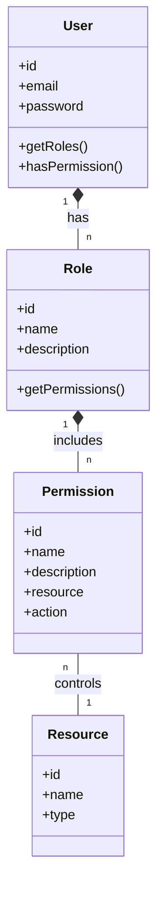
```mermaid
classDiagram
    class User {
        +id
        +email
        +password
        +getRoles()
        +hasPermission()
    }
    
    class Role {
        +id
        +name
        +description
        +getPermissions()
    }
    
    class Permission {
        +id
        +name
        +description
        +resource
        +action
    }
    
    class Resource {
        +id
        +name
        +type
    }
    
    User "1" *-- "n" Role : has
    Role "1" *-- "n" Permission : includes
    Permission "n" -- "1" Resource : controls
```

1. **ロールベースの権限システム**
   - 事前定義ロール：一般ユーザー、モデレーター、管理者、システム管理者
   - カスタムロール作成機能（将来的に）
   - リソースごとのきめ細かい権限設定

2. **アクセス制御ロジック**
   - ミドルウェアによる認可チェック
   - ポリシーとゲートの活用（Laravel標準機能）
   - リソースごとの所有者チェック

### 拡張セキュリティ対策

以下の拡張セキュリティ対策を段階的に実装し、アプリケーションのセキュリティポスチャーを強化します。

#### 認証システム拡張

1. **JWT実装強化**
   - RS256非対称署名アルゴリズムの採用
   - 秘密鍵のセキュアな管理（AWS KMS連携）
   - リフレッシュトークンローテーション方式の導入

2. **リスクベース認証**
   - 特権操作に対する多要素認証
   - デバイスフィンガープリントによる認証強化
   - 異常ログインパターン検出

#### データ保護拡張

1. **列レベル暗号化**
   - センシティブデータの選択的暗号化
   - アプリケーションレベルでの透過的暗号化

2. **データマスキング**
   - APIレスポンスでのセンシティブデータ保護
   - 権限に基づく情報開示制御

#### API保護拡張

1. **多層レート制限**
   - グローバル、エンドポイント、ユーザーごとの制限
   - 動的しきい値調整

2. **セキュリティヘッダー実装**
   - CSP、HSTS、X-Content-Type-Options設定
   - レスポンスヘッダーの一貫した適用

#### ファイルアップロードセキュリティ

1. **高度なファイル検証**
   - MIME型とファイル内容の整合性チェック
   - 悪意のあるコードシグネチャ検出

2. **マルウェアスキャン統合**
   - ClamAVとの連携
   - 定期的な既存ファイルの再スキャン

#### コンテンツセキュリティ

1. **HTMLサニタイズ**
   - DOMPurifyの実装
   - ユーザー生成コンテンツの安全な処理

2. **機械学習モデレーション**
   - 有害コンテンツの自動検出
   - モデレーションキューの実装

### セキュリティ運用と監視

1. **セキュリティ監視システム**
   - ログ集中管理
   - 異常検出アラート
   - インシデント対応手順

2. **定期的なセキュリティテスト**
   - 年2回の脆弱性評価
   - クォータリーペネトレーションテスト
   - 継続的な自動スキャン

3. **セキュリティ成熟度モデル**
   - 段階的なセキュリティ機能実装計画
   - セキュリティKPIの定義と追跡
   - インシデント対応時間の短縮目標

## スケーラビリティ設計

### 負荷対策

1. **水平スケーリングポイント**
   - Webサーバー層：複数インスタンス配置（将来的に）
   - キャッシュ層：Redis分散構成
   - データベース：読み取りレプリカ（将来的に）

2. **パフォーマンスボトルネック対策**
   - 複雑なクエリの事前キャッシュ
   - 重要度計算の非同期バッチ処理化
   - 大規模ツリーの部分読み込み実装

3. **段階的スケールアウト計画**
   - 1万ユーザー：単一サーバー＋キャッシュ強化
   - 5万ユーザー：読み取りレプリカ導入
   - 10万ユーザー：サービス分離とロードバランサー導入

### トラフィック管理

1. **レートリミット実装**
   - 匿名ユーザー：1分間に30リクエスト
   - 認証済みユーザー：1分間に60リクエスト
   - API利用者：1分間に120リクエスト（トークンベース）

2. **コネクション管理**
   - データベースコネクションプール
   - クエリタイムアウト設定（30秒）
   - 長時間クエリの監視と最適化

3. **非同期処理**
   - 投稿インデックス更新の非同期処理
   - 通知送信のキュー処理
   - 重要度再計算のバッチ処理

### データ成長対策

1. **パーティショニング戦略**
   - 投稿テーブル：日付ベースのパーティショニング
   - アクセスログ：月次パーティショニング
   - 古いデータのアーカイブポリシー

2. **インデックス戦略**
   - 複合インデックスの最適化
   - 検索クエリ向けの特殊インデックス
   - インデックスメンテナンス計画

## 実装優先順位

### 優先度評価マトリックス

| 機能 | ビジネス重要度 | 技術的複雑さ | 実装難易度 | 優先度 |
|------|--------------|------------|-----------|-------|
| ユーザー認証 | 高 | 低 | 低 | P0 |
| 基本投稿機能 | 高 | 中 | 中 | P0 |
| 基本ツリー表示 | 高 | 高 | 高 | P0 |
| 検索機能 | 高 | 中 | 中 | P1 |
| 投稿形式の全種類対応 | 中 | 低 | 低 | P1 |
| ネットワークビュー | 中 | 高 | 高 | P2 |
| ズームレベル対応表示 | 中 | 高 | 高 | P2 |
| 信頼性スコア | 中 | 中 | 中 | P2 |
| 多言語対応 | 低 | 中 | 中 | P3 |
| AIアシスタント | 低 | 高 | 高 | P3 |
| WebGL可視化エンジン | 高 | 高 | 高 | P1 |
| 階層的クラスタリング | 高 | 中 | 中 | P1 |
| 仮想スクロール統合 | 中 | 中 | 中 | P2 |

### 実装スケジュール

#### フェーズ1（MVP）- 3ヶ月
1. ユーザー認証・管理システム - 2週間
2. 基本投稿機能（3種類） - 3週間
3. シンプルなツリービュー - 4週間
4. 基本検索・フィルタリング - 2週間
5. 最小限モデレーション - 1週間
6. テスト・バグ修正 - 2週間

#### フェーズ2（拡張）- 4ヶ月
1. 残りの投稿形式実装 - 3週間
2. ネットワークビュー実装 - 5週間
3. 信頼性スコアシステム - 3週間
4. コミュニティ機能 - 3週間
5. 通知システム - 2週間
6. 高度検索機能 - 2週間
7. テスト・最適化 - 2週間

#### フェーズ3（完全版）- 5ヶ月
1. AIアシスタント統合 - 6週間
2. 時系列ビュー - 4週間
3. パーソナライゼーション - 3週間
4. コラボレーション機能 - 4週間
5. 外部システム連携 - 3週間
6. アクセシビリティ強化 - 2週間
7. 最終テスト・最適化 - 2週間

### 技術的リスクと対策

| リスク | 影響度 | 発生確率 | 対策 |
|-------|-------|---------|------|
| 大規模ツリー表示の性能問題 | 高 | 高 | 部分読み込み、WebGL採用、サーバーサイドレンダリング検討 |
| 複雑な関係性クエリのパフォーマンス | 高 | 中 | クエリ最適化、キャッシュ強化、インデックス設計見直し |
| モバイル端末での表示問題 | 中 | 高 | モバイルファーストデザイン、レスポンシブテスト強化 |
| レンタルサーバー制限への抵触 | 高 | 中 | リソース使用量監視、段階的なスケールアウト計画 |
| データ整合性問題 | 中 | 低 | トランザクション制御強化、整合性テスト追加 |

### フロントエンド
    * Remix (Reactフレームワーク)
    * React
    * Ant Design (ReactのUIコンポーネントライブラリ)
    * TypeScript
    * TailwindCSS
    * 多言語対応（UIやシステムメッセージのみ、投稿コンテンツは翻訳機能で対応）

### 管理者フロントエンド
    * 別SPAとして実装
    * React
    * Ant Design (ReactのUIコンポーネントライブラリ)
    * TypeScript
    * 独立したデプロイとホスティング
    * 別ドメインまたはサブドメインでの提供
    * 専用の認証システム（多要素認証対応）

### バックエンド

フレームワーク Laravel 12.x

データベース MariaDB 10.5.x

### サーバー

xserver(レンタルサーバー)

使用可能なミドルウェア nginx PHP8 Cron

## 開発・運用ライフサイクル

### 開発環境

1. **ローカル開発環境**
   - Docker開発環境
   - 開発用データベース (SQLite/MariaDB)
   - Hot Reloading対応

2. **開発プロセス**
   - GitHubフローによるブランチ管理
   - プルリクエストと強制的なコードレビュー
   - 自動テスト実行（GitHub Actions）

### テスト戦略

1. **ユニットテスト**
   - PHPUnit（Laravel）
   - Jest（React/TypeScript）
   - ビジネスロジックの網羅的テスト

2. **統合テスト**
   - API統合テスト（エンドポイントごと）
   - フロントエンドコンポーネントテスト
   - データフローの検証

3. **E2Eテスト**
   - Cypress を使用したブラウザテスト
   - 主要ユーザーフロー（登録・投稿・検索）の検証
   - レスポンシブデザインの検証

4. **パフォーマンステスト**
   - API負荷テスト
   - 大規模データセットでの可視化テスト
   - ブラウザパフォーマンス計測

### デプロイメント

1. **ステージング環境**
   - 本番環境レプリカでのプレリリーステスト
   - 手動QA検証
   - ステークホルダーデモ

2. **本番環境デプロイプロセス**
   - Gitタグベースのリリースフロー
   - ブルー/グリーンデプロイメント（将来的に）
   - ゼロダウンタイムデプロイ（可能な限り）

3. **リリース後監視**
   - デプロイ直後の重点的モニタリング
   - カナリアテスト（一部ユーザーへの段階的ロールアウト）
   - 緊急ロールバック手順

#### 使用するAPIパターン

RESTful API:
    投稿の作成・更新・削除
    ユーザー管理
    マルチメディア管理
    管理者API（別途認証と権限管理）

GraphQL:
    投稿の取得
    複雑な論理構造と多対多の関係性の取得に最適
    クライアントが必要なデータだけを正確に取得できる（オーバーフェッチングの回避）
    ツリー状の議論構造や関連投稿を効率的に一度のリクエストで取得

Webhook(保留):
    アプリを作成する際に追加予定
    リアルタイム通知（新しい返信、検証結果など）に利用

WebSocketの導入(保留):
    リアルタイムの議論状況や協調編集機能のサポート
    複数ユーザーによるリアルタイム検証作業に有効

## 状態遷移図

### 投稿状態遷移

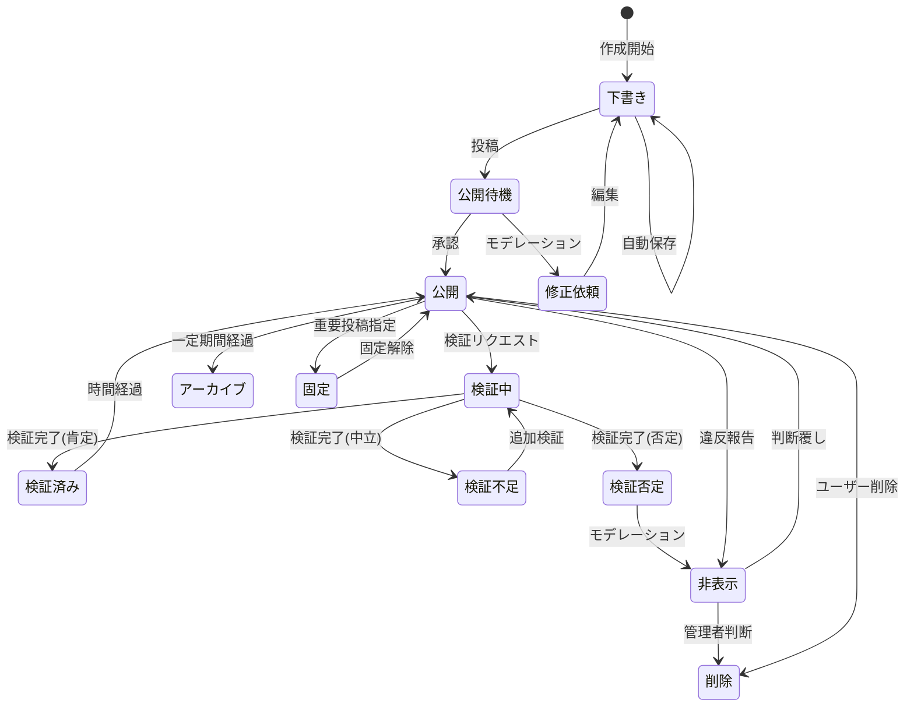
```mermaid
stateDiagram-v2
    [*] --> 下書き: 作成開始
    下書き --> 下書き: 自動保存
    下書き --> 公開待機: 投稿
    公開待機 --> 公開: 承認
    公開待機 --> 修正依頼: モデレーション
    修正依頼 --> 下書き: 編集
    公開 --> 検証中: 検証リクエスト
    検証中 --> 検証済み: 検証完了(肯定)
    検証中 --> 検証不足: 検証完了(中立)
    検証中 --> 検証否定: 検証完了(否定)
    検証済み --> 公開: 時間経過
    検証不足 --> 検証中: 追加検証
    検証否定 --> 非表示: モデレーション
    公開 --> 非表示: 違反報告
    非表示 --> 削除: 管理者判断
    非表示 --> 公開: 判断覆し
    公開 --> 削除: ユーザー削除
    公開 --> アーカイブ: 一定期間経過
    公開 --> 固定: 重要投稿指定
    固定 --> 公開: 固定解除
```

### ユーザー権限状態遷移

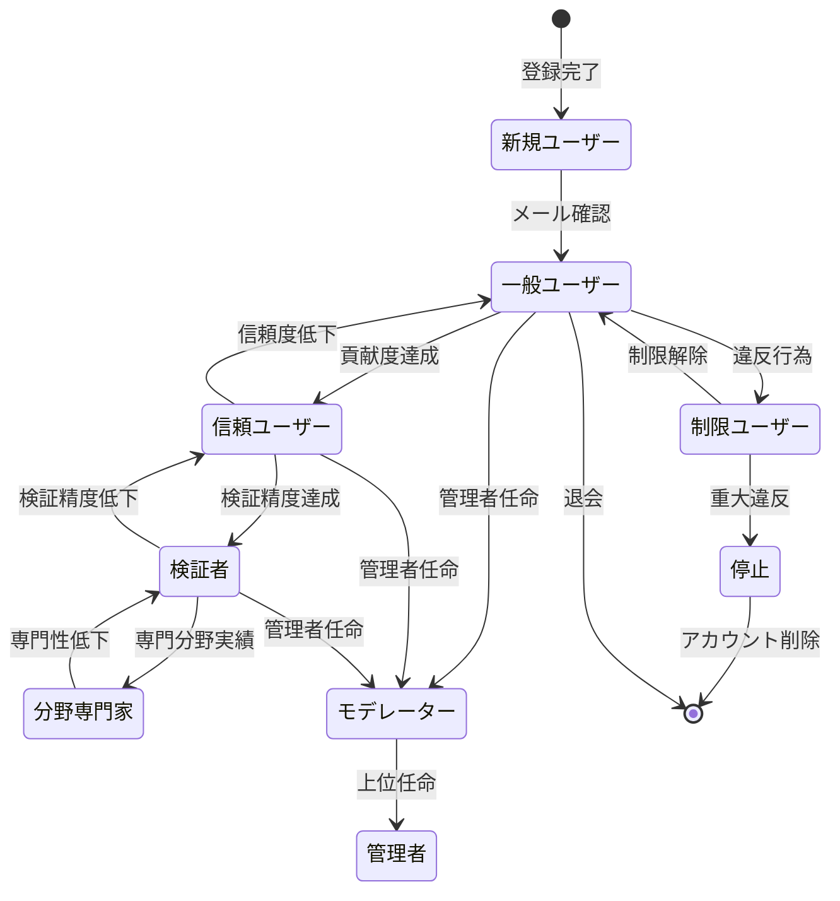
```mermaid
stateDiagram-v2
    [*] --> 新規ユーザー: 登録完了
    新規ユーザー --> 一般ユーザー: メール確認
    一般ユーザー --> 信頼ユーザー: 貢献度達成
    一般ユーザー --> 制限ユーザー: 違反行為
    制限ユーザー --> 一般ユーザー: 制限解除
    制限ユーザー --> 停止: 重大違反
    信頼ユーザー --> 検証者: 検証精度達成
    信頼ユーザー --> 一般ユーザー: 信頼度低下
    検証者 --> 分野専門家: 専門分野実績
    検証者 --> 信頼ユーザー: 検証精度低下
    分野専門家 --> 検証者: 専門性低下
    一般ユーザー --> モデレーター: 管理者任命
    信頼ユーザー --> モデレーター: 管理者任命
    検証者 --> モデレーター: 管理者任命
    モデレーター --> 管理者: 上位任命
    停止 --> [*]: アカウント削除
    一般ユーザー --> [*]: 退会
```

### 検証プロセス状態遷移

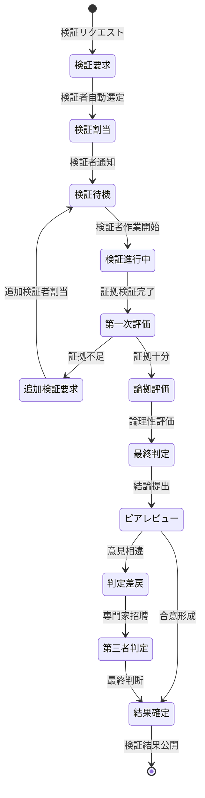
```mermaid
stateDiagram-v2
    [*] --> 検証要求: 検証リクエスト
    検証要求 --> 検証割当: 検証者自動選定
    検証割当 --> 検証待機: 検証者通知
    検証待機 --> 検証進行中: 検証者作業開始
    検証進行中 --> 第一次評価: 証拠検証完了
    第一次評価 --> 追加検証要求: 証拠不足
    追加検証要求 --> 検証待機: 追加検証者割当
    第一次評価 --> 論拠評価: 証拠十分
    論拠評価 --> 最終判定: 論理性評価
    最終判定 --> ピアレビュー: 結論提出
    ピアレビュー --> 結果確定: 合意形成
    ピアレビュー --> 判定差戻: 意見相違
    判定差戻 --> 第三者判定: 専門家招聘
    第三者判定 --> 結果確定: 最終判断
    結果確定 --> [*]: 検証結果公開
```

## シーケンス図

### ユーザー登録から投稿作成までのフロー

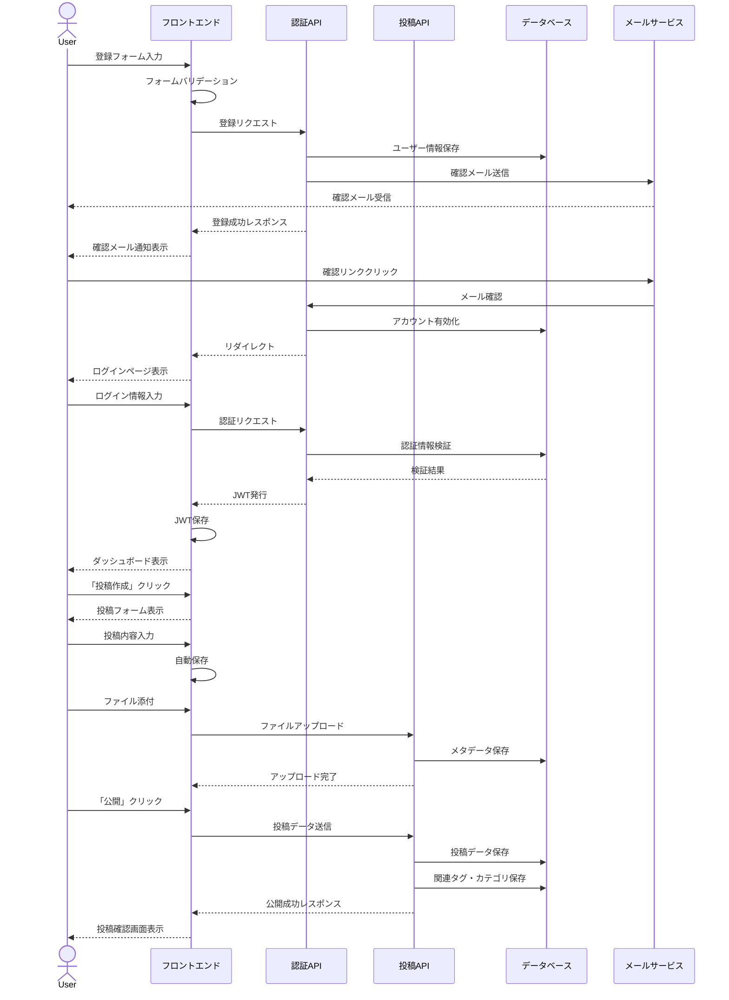
```mermaid
sequenceDiagram
    actor User
    participant Frontend as フロントエンド
    participant AuthAPI as 認証API
    participant PostAPI as 投稿API
    participant DB as データベース
    participant Email as メールサービス
    
    User->>Frontend: 登録フォーム入力
    Frontend->>Frontend: フォームバリデーション
    Frontend->>AuthAPI: 登録リクエスト
    AuthAPI->>DB: ユーザー情報保存
    AuthAPI->>Email: 確認メール送信
    Email-->>User: 確認メール受信
    AuthAPI-->>Frontend: 登録成功レスポンス
    Frontend-->>User: 確認メール通知表示
    
    User->>Email: 確認リンククリック
    Email->>AuthAPI: メール確認
    AuthAPI->>DB: アカウント有効化
    AuthAPI-->>Frontend: リダイレクト
    Frontend-->>User: ログインページ表示
    
    User->>Frontend: ログイン情報入力
    Frontend->>AuthAPI: 認証リクエスト
    AuthAPI->>DB: 認証情報検証
    DB-->>AuthAPI: 検証結果
    AuthAPI-->>Frontend: JWT発行
    Frontend->>Frontend: JWT保存
    Frontend-->>User: ダッシュボード表示
    
    User->>Frontend: 「投稿作成」クリック
    Frontend-->>User: 投稿フォーム表示
    User->>Frontend: 投稿内容入力
    Frontend->>Frontend: 自動保存
    User->>Frontend: ファイル添付
    Frontend->>PostAPI: ファイルアップロード
    PostAPI->>DB: メタデータ保存
    PostAPI-->>Frontend: アップロード完了
    User->>Frontend: 「公開」クリック
    Frontend->>PostAPI: 投稿データ送信
    PostAPI->>DB: 投稿データ保存
    PostAPI->>DB: 関連タグ・カテゴリ保存
    PostAPI-->>Frontend: 公開成功レスポンス
    Frontend-->>User: 投稿確認画面表示
```

### 検証プロセスの詳細フロー

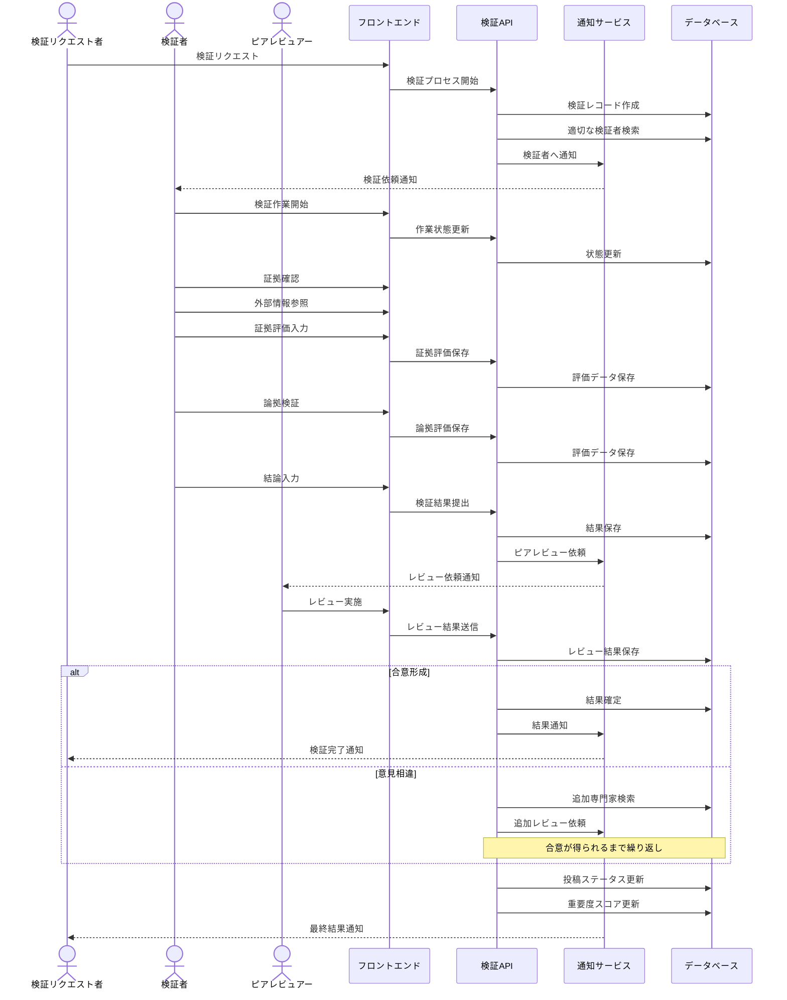
```mermaid
sequenceDiagram
    actor Requester as 検証リクエスト者
    actor Verifier as 検証者
    actor PeerReviewer as ピアレビュアー
    participant Frontend as フロントエンド
    participant VerificationAPI as 検証API
    participant NotificationSvc as 通知サービス
    participant DB as データベース
    
    Requester->>Frontend: 検証リクエスト
    Frontend->>VerificationAPI: 検証プロセス開始
    VerificationAPI->>DB: 検証レコード作成
    VerificationAPI->>DB: 適切な検証者検索
    VerificationAPI->>NotificationSvc: 検証者へ通知
    NotificationSvc-->>Verifier: 検証依頼通知
    
    Verifier->>Frontend: 検証作業開始
    Frontend->>VerificationAPI: 作業状態更新
    VerificationAPI->>DB: 状態更新
    
    Verifier->>Frontend: 証拠確認
    Verifier->>Frontend: 外部情報参照
    Verifier->>Frontend: 証拠評価入力
    Frontend->>VerificationAPI: 証拠評価保存
    VerificationAPI->>DB: 評価データ保存
    
    Verifier->>Frontend: 論拠検証
    Frontend->>VerificationAPI: 論拠評価保存
    VerificationAPI->>DB: 評価データ保存
    
    Verifier->>Frontend: 結論入力
    Frontend->>VerificationAPI: 検証結果提出
    VerificationAPI->>DB: 結果保存
    VerificationAPI->>NotificationSvc: ピアレビュー依頼
    NotificationSvc-->>PeerReviewer: レビュー依頼通知
    
    PeerReviewer->>Frontend: レビュー実施
    Frontend->>VerificationAPI: レビュー結果送信
    VerificationAPI->>DB: レビュー結果保存
    
    alt 合意形成
        VerificationAPI->>DB: 結果確定
        VerificationAPI->>NotificationSvc: 結果通知
        NotificationSvc-->>Requester: 検証完了通知
    else 意見相違
        VerificationAPI->>DB: 追加専門家検索
        VerificationAPI->>NotificationSvc: 追加レビュー依頼
        Note over VerificationAPI,DB: 合意が得られるまで繰り返し
    end
    
    VerificationAPI->>DB: 投稿ステータス更新
    VerificationAPI->>DB: 重要度スコア更新
    NotificationSvc-->>Requester: 最終結果通知
```

## エラーハンドリング仕様

### エラーコード体系

| エラーコード | 種類 | 説明 |
|------------|------|------|
| AUTH_001 | 認証エラー | 認証情報が無効 |
| AUTH_002 | 認証エラー | アクセストークンの期限切れ |
| AUTH_003 | 認証エラー | リフレッシュトークンの期限切れ |
| AUTH_004 | 認証エラー | アカウントが無効化されている |
| PERM_001 | 権限エラー | 操作に必要な権限がない |
| PERM_002 | 権限エラー | リソースへのアクセス権限がない |
| VAL_001 | バリデーションエラー | 必須フィールドの欠落 |
| VAL_002 | バリデーションエラー | フィールド形式が不正 |
| VAL_003 | バリデーションエラー | データ長の制限超過 |
| RES_001 | リソースエラー | リソースが存在しない |
| RES_002 | リソースエラー | 重複するリソース |
| RATE_001 | レート制限エラー | APIリクエスト制限超過 |
| SERV_001 | サーバーエラー | 内部サーバーエラー |
| SERV_002 | サーバーエラー | 外部サービス連携失敗 |
| MEDIA_001 | メディアエラー | ファイルサイズ超過 |
| MEDIA_002 | メディアエラー | 未対応のファイル形式 |
| MEDIA_003 | メディアエラー | ファイルアップロード失敗 |

### エラーレスポンス形式

```json
{
  "status": "error",
  "code": "VAL_002",
  "message": "メールアドレスの形式が正しくありません",
  "details": {
    "field": "email",
    "reason": "invalid_format",
    "provided": "example.com",
    "expected": "user@example.com"
  },
  "request_id": "req_7a9c83d421",
  "documentation_url": "https://api.domain.com/docs/errors#VAL_002"
}
```

### 例外処理戦略

1. **フロントエンド例外処理**
   - グローバルエラーハンドラーの実装
   - ネットワークエラーの自動リトライ（指数バックオフ）
   - オフライン操作のキューイング
   - フレンドリーなエラーメッセージの表示
   - フォームバリデーションエラーのインライン表示

2. **バックエンド例外処理**
   - 構造化された例外クラス階層
   - トランザクション管理による整合性確保
   - 詳細なログ記録（エラーコンテキスト含む）
   - センシティブ情報のフィルタリング
   - 一貫したエラーレスポンス形式

3. **回復戦略**
   - 自動リカバリーメカニズム
   - 段階的デグラデーション（一部機能のみ制限）
   - フォールバックオプション（キャッシュデータ使用など）
   - 非同期操作の再開ポイント
   - エラー通知と監視アラート連携

## キャッシュ戦略詳細

### キャッシュレイヤー構成

1. **ブラウザキャッシュ**
   - 静的アセット: 1週間（Cache-Control: max-age=604800）
   - API応答: 状況に応じたETags使用
   - LocalStorage: ユーザー設定、ドラフト（容量制限あり）

2. **CDNキャッシュ** （保留）
   - 画像、動画、文書: 1ヶ月（エッジロケーション）
   - 静的ページ: 1日（Surrogate-Control指定）
   - キャッシュパージAPIによる即時無効化対応

3. **アプリケーションキャッシュ**
   - React Query: カスタムstaleTime設定
   - Apollo Cache: GraphQLクエリ結果
   - 投稿データ: 5分間有効（更新頻度低）
   - ユーザープロフィール: 1時間有効
   - 検索結果: 15分間有効

4. **サーバーキャッシュ**
   - Laravel Cache: DB負荷軽減
   - 論理ツリー構造: 10分間有効
   - 重要度計算結果: 1時間有効
   - セッションストア: Redis使用

5. **ビジュアライゼーションキャッシュ**
   * **階層的クラスタリングキャッシュ**
     - 予め計算された階層グラフ構造のキャッシュ
     - 5段階の詳細度レベルを使用
     - 24時間有効（重要度スコア更新に合わせて再計算）
   * **レイアウトキャッシュ**
     - グラフレイアウト計算結果の保存
     - ユーザーごとの現在ビュー状態保存
     - WebGLバッファのインデックス化
   * **テクスチャアトラス**
     - ノードアイコン・マーカーの事前バッチ処理
     - 共通視覚要素のGPUメモリ効率化
     - 動的生成スプライトの再利用

### キャッシュキー命名規則

```
{サービス名}:{リソースタイプ}:{ID}:{バージョン}
```

例:
- `sns:post:12345:v1` - 投稿データのキャッシュ
- `sns:user:789:v2` - ユーザープロフィールのキャッシュ
- `sns:tree:post_12345:v1` - 投稿12345を中心とした論理ツリー
- `sns:search:keyword_science:v1` - 「science」の検索結果

### 無効化戦略

1. **明示的無効化**
   - 投稿更新時: 特定キーと関連キーを無効化
   - ユーザープロフィール更新時: 関連キャッシュ全て無効化
   - 管理者アクション: 広範囲のキャッシュパージ

2. **時間ベース期限切れ**
   - TTL設定による自動期限切れ
   - 更新頻度に応じた最適TTL設計
   - バックグラウンド再生成（将来的機能）

3. **バージョニング**
   - リソース更新時にバージョン番号を変更
   - 古いバージョンは参照されなくなり自動期限切れ
   - データモデル変更時の互換性担保

### キャッシュの整合性確保

1. **Pub/Sub無効化**
   - 更新イベント発行による関連キャッシュの無効化
   - イベントペイロードに影響範囲情報含む

2. **Write-Through戦略**
   - データ更新時に同時にキャッシュも更新
   - トランザクション内でのキャッシュ操作

3. **コンディショナルリクエスト**
   - If-None-Match / ETags活用
   - 304 Not Modified応答によるトラフィック削減

4. **キャッシュウォーミング**
   - 定期的なバックグラウンドジョブによる再生成
   - 高需要リソースの事前キャッシュ

## 法的コンプライアンスシステム

### 著作権保護サブシステム

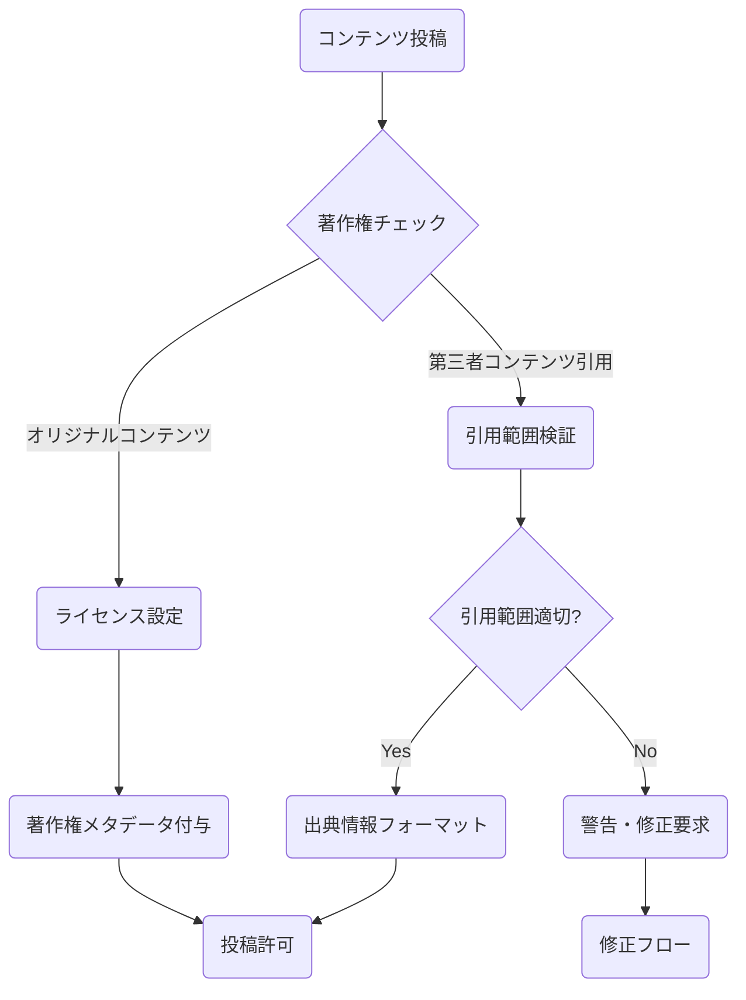
```mermaid
flowchart TD
    A("コンテンツ投稿") --> B{"著作権チェック"}
    B -->|"第三者コンテンツ引用"| C("引用範囲検証")
    B -->|"オリジナルコンテンツ"| D("ライセンス設定")
    C --> E{"引用範囲適切?"}
    E -->|"Yes"| F("出典情報フォーマット")
    E -->|"No"| G("警告・修正要求")
    F --> H("投稿許可")
    G --> I("修正フロー")
    D --> J("著作権メタデータ付与")
    J --> H
```

### 魚拓サブシステム
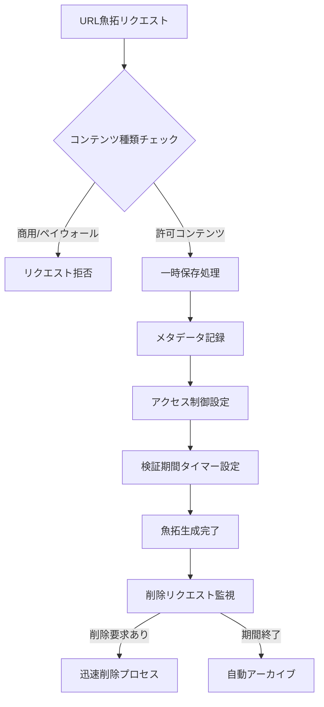
```mermaid
flowchart TD
    A[URL魚拓リクエスト] --> B{コンテンツ種類チェック}
    B -->|商用/ペイウォール| C[リクエスト拒否]
    B -->|許可コンテンツ| D[一時保存処理]
    D --> E[メタデータ記録]
    E --> F[アクセス制御設定]
    F --> G[検証期間タイマー設定]
    G --> H[魚拓生成完了]
    H --> I[削除リクエスト監視]
    I -->|削除要求あり| J[迅速削除プロセス]
    I -->|期間終了| K[自動アーカイブ]
```

