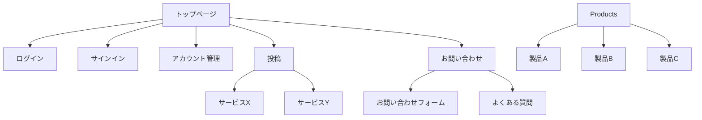

# ユーザーインターフェース仕様書

## 概要

### UI設計の目的

「問題の解決」に焦点が当たるようにデザイン

### 対象ユーザー

### 設計原則

一貫性（Consistency）

同様の操作や要素は同じように機能するべき
用語、レイアウト、色、アイコンなどの視覚言語を統一する

シンプルさ（Simplicity）

必要な機能だけを表示し、複雑さを隠す
ユーザーの認知負荷を最小限に抑える

フィードバック（Feedback）

ユーザーの操作に対して即座に反応を示す
システムの状態や操作の結果を明確に伝える

フォーギブネス（Forgiveness）

ユーザーのミスを防止し、容易に修正できるようにする
「元に戻す」機能などでリカバリーを可能にする

ユーザーコントロール（User Control）

ユーザーが操作の主導権を持っていると感じられるようにする
強制的な流れではなく、選択肢を提供する

認知しやすさ（Recognition over Recall）

記憶に頼るよりも、視覚的に認識できる要素を提供する
選択肢を明示する

効率性（Efficiency）

頻繁に使用する機能へのアクセスを容易にする
ショートカットやアクセラレーターを提供する

アクセシビリティ（Accessibility）

様々な能力を持つユーザーが利用できるよう設計する
スクリーンリーダー対応、色覚異常への配慮など

審美性（Aesthetics）

視覚的に魅力的で、使用したくなるデザイン
適切な余白、配色、タイポグラフィを使用する

### 全体的なユーザー体験の方針

自分のアイディアや能力を自然に活用したくなるようにし、「問題の解決」に焦点が当たるようにデザインする

また問題解決のための行動に自然と導く

## 情報アーキテクチャ

### サイトマップ

### 画面遷移図

## ビジュアルデザイン要素

カラーパレット
タイポグラフィ（フォントとサイズ）
アイコンと画像ガイドライン
スペーシングとレイアウトルール

## コンポーネントライブラリ

ボタン
フォーム要素
ナビゲーション要素
モーダル・ダイアログ
カード・パネル
その他の再利用可能なUI要素

## 画面仕様

各画面のワイヤーフレームまたはモックアップ
画面の要素配置と寸法
状態変化（通常、ホバー、アクティブ、無効など）
レスポンシブデザインの挙動

## インタラクション仕様

クリックやタップの挙動
ドラッグ＆ドロップなどの高度なインタラクション
アニメーションとトランジション
フィードバック方法（ローディング表示、エラー表示など）

## エラー状態とエッジケース

エラーメッセージの表示方法
空の状態の表示
データロード中の表示
ゼロデータ状態の表示

## アクセシビリティ対応

キーボードナビゲーション
スクリーンリーダー対応
コントラスト比
フォーカス表示

## 国際化と地域化

多言語対応の方針
日付、時間、数値のフォーマット
文字列拡張への対応

## テスト計画

ユーザビリティテスト方法
A/Bテスト計画
主観的評価基準

## 実装ガイドライン

フロントエンド開発者向けの注意点
既存のUIフレームワークの使用方法
パフォーマンス最適化のヒント

## 更新履歴

変更点のトラッキング
バージョン管理

