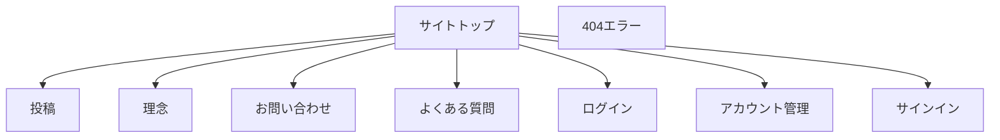

# ユーザーインターフェース仕様書

## 概要

### UI設計の目的

「問題の解決」に焦点が当たるようにデザイン

### 対象ユーザー

* 専門家
    * 日常的な議論、課題の整理（20代〜70代、デジタルリテラシーの幅広い層）
    * 主な利用機能：情報検索、投稿
* 一般消費者
    * 日常的な観覧、発案（20代〜70代、デジタルリテラシーの幅広い層）
    * 主な利用機能：情報検索、投稿
* AI開発者
    * AIの学習、確かな情報の取得
    * 主な利用機能：連携API

### 全体的なユーザー体験の方針

自分のアイディアや能力を自然に活用したくなるようにし、「問題の解決」に焦点が当たるようにデザインする

また問題解決のための行動に自然と導く

### 設計原則

一貫性（Consistency）

同様の操作や要素は同じように機能するべき
用語、レイアウト、色、アイコンなどの視覚言語を統一する

シンプルさ（Simplicity）

必要な機能だけを表示し、複雑さを隠す
ユーザーの認知負荷を最小限に抑える

フィードバック（Feedback）

ユーザーの操作に対して即座に反応を示す
システムの状態や操作の結果を明確に伝える

フォーギブネス（Forgiveness）

ユーザーのミスを防止し、容易に修正できるようにする
「元に戻す」機能などでリカバリーを可能にする

ユーザーコントロール（User Control）

ユーザーが操作の主導権を持っていると感じられるようにする
強制的な流れではなく、選択肢を提供する

認知しやすさ（Recognition over Recall）

記憶に頼るよりも、視覚的に認識できる要素を提供する
選択肢を明示する

効率性（Efficiency）

頻繁に使用する機能へのアクセスを容易にする
ショートカットやアクセラレーターを提供する

アクセシビリティ（Accessibility）

様々な能力を持つユーザーが利用できるよう設計する
スクリーンリーダー対応、色覚異常への配慮など

審美性（Aesthetics）

視覚的に魅力的で、使用したくなるデザイン
適切な余白、配色、タイポグラフィを使用する

## 情報アーキテクチャ

情報の組織化と構造化: データや情報をどのように分類し、整理するか
ナビゲーションシステム: ユーザーが情報にアクセスする方法
ラベリングシステム: 情報カテゴリーに名前をつける方法
検索システム: ユーザーが情報を探す方法

### サイトマップ

* サイトトップ(投稿を見れる)
    * 投稿
    * 理念
    * お問い合わせ
    * よくある質問
    * ログイン
    * アカウント管理
    * サインイン
    * 404エラー

### 画面遷移図

## ビジュアルデザイン要素

白をイメージカラーとする

## コンポーネントライブラリ

Ant Design

## 画面仕様

パソコン、タブレット、スマホを想定

コンポーネントライブラリのレスポンシブデザイン

## インタラクション仕様

投稿を見れるページでは非同期通信で画面をパン移動すると自動読み込み

## エラー状態とエッジケース

エラーメッセージの表示方法
空の状態の表示
データロード中の表示
ゼロデータ状態の表示

## アクセシビリティ対応

キーボードナビゲーション（未対応）
スクリーンリーダー対応
コントラスト比
フォーカス表示

## 国際化と地域化

多言語化を見据えるが現状は日本語のみ
多言語対応の方針: 日本語と英語
摂氏、日本時間、西暦を使用する

## テスト計画

ユーザビリティテスト方法
A/Bテスト計画
主観的評価基準

## 実装ガイドライン

フロントエンド開発者向けの注意点
既存のUIフレームワークの使用方法
パフォーマンス最適化のヒント

## 更新履歴

バージョン管理はgitを使用すること

変更点のトラッキング
プロジェクトルートにhistoryディレクトリを作成しそこにファイルを作る
1年1ファイル
ファイル名は西暦で拡張子はmd
リリースごとに日付と変更の要点を書く

